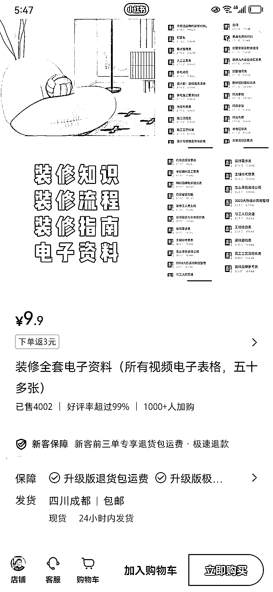

# 小红书垂直类账号：卖家装虚拟资料，可扩展至教育等产品

> 原文：[`www.yuque.com/for_lazy/xkrm14/klscn8boq2trxkcy`](https://www.yuque.com/for_lazy/xkrm14/klscn8boq2trxkcy)

作者： 向阳

日期：2023-12-28

点赞数：**127**

* * *

正文：

小红书上卖虚拟资料还是可以的，做一个垂直类账号，然后卖这类的电子资料，这个是家装的，可以扩展延伸到教育等产品上去

* * *

评论区：

晓航老师 : 卖别人的电子资料，会构成犯罪么？

克里斯蒂亚诺～赫 : 换个文本模版，不久成自己的了

银老板 : 没有版权的可以

晓航老师 : 没那么简单吧😂

向阳 : 这种收集整理资料哪来的版权

晓航老师 : 我有各大机构的讲义和习题

十二 : 天

* * *

公众号懒人找资源，懒人专属群分享