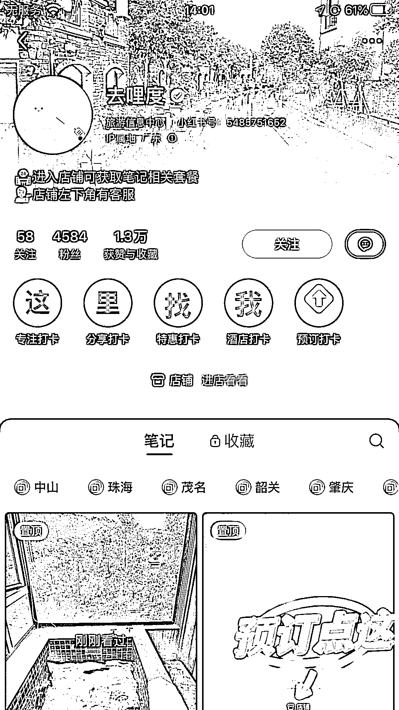
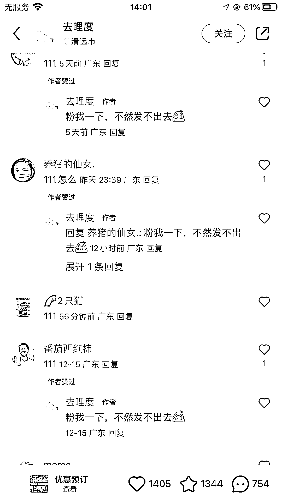
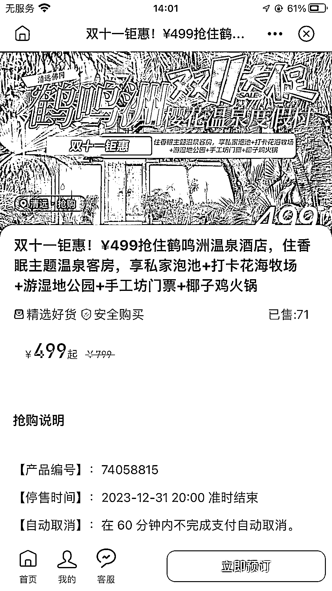
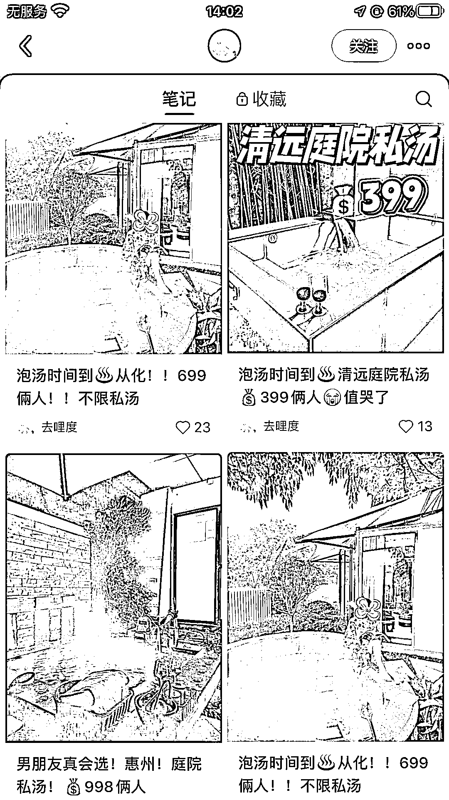

# 小红书成为本地旅游和酒店团票的热门推广平台

> 原文：[`www.yuque.com/for_lazy/xkrm14/mp4k98ctlcub4sx9`](https://www.yuque.com/for_lazy/xkrm14/mp4k98ctlcub4sx9)

作者： 惠玲

日期：2023-12-27

点赞数：**64**

* * *

正文：

做本地旅游，或者酒店团票的同学，可以在小红书发帖子可，挂链接是可以自己店铺挂，也能发帖子推别人的链接。 城市附近，周末周边游，两天一夜的这种。 需求不小。

* * *

评论区：

惠玲 : 谢谢亦仁大大！[害羞]

深元哥 : 请问这种是要开通挂车功能是不？

秀强 : 前两天还和同事说找个温泉泡一下

sunyue : 1000 粉丝自动开通

深元哥 : 我 9000 粉 但我没看到自己开通了没有...

sunyue : 发布笔记那里，有关联商品哦，可以试试

深元哥 : 好的，谢谢你

* * *

公众号懒人找资源，懒人专属群分享