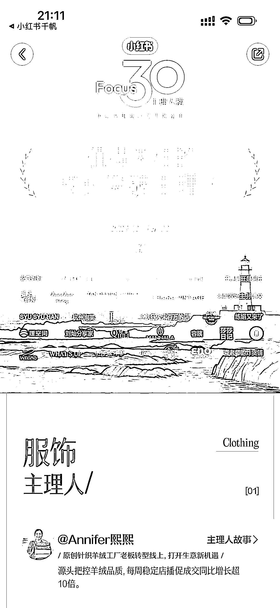
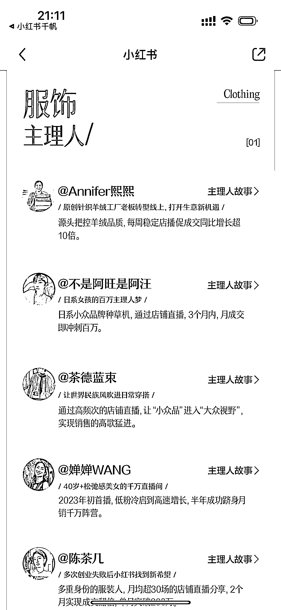
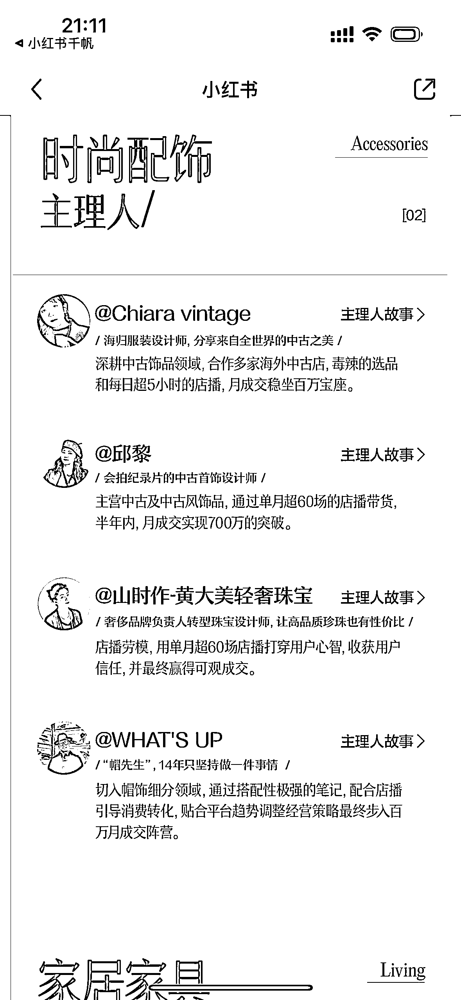
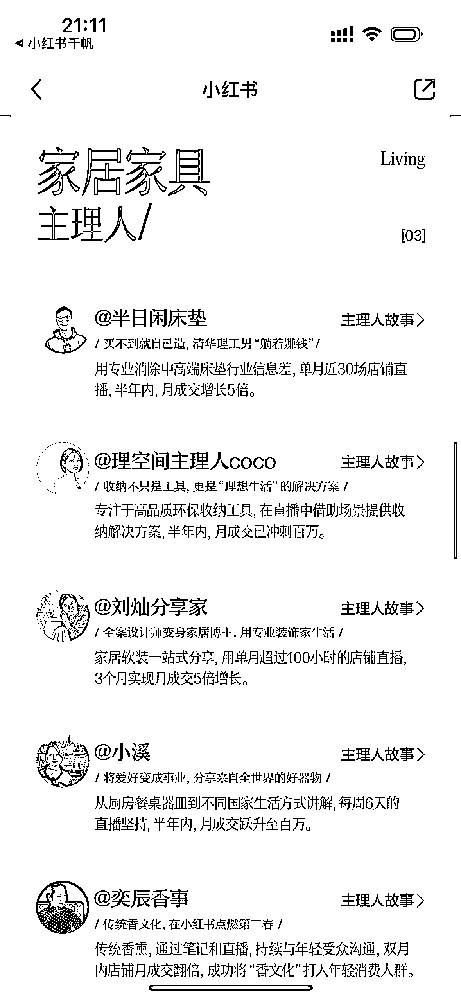
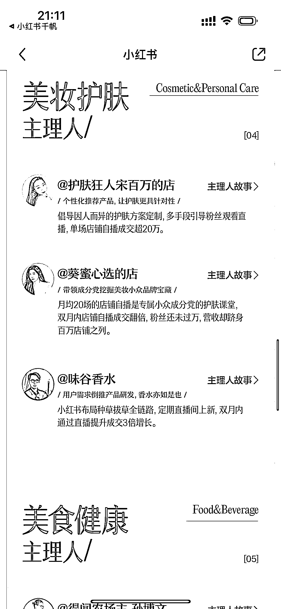
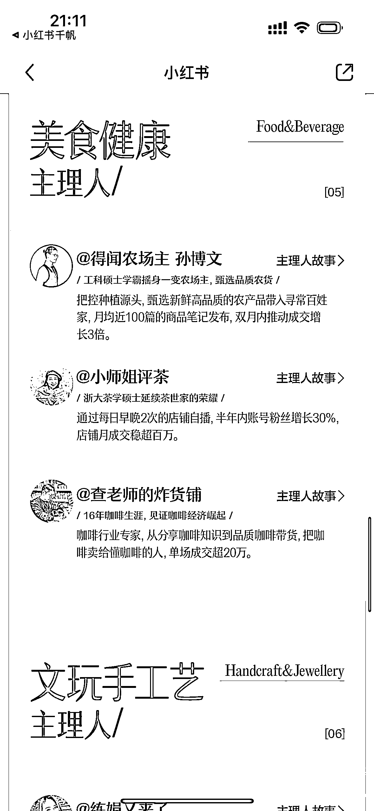

# 小红书发布“值得关注的主理人”榜单，寻找头部对标博主

> 原文：[`www.yuque.com/for_lazy/xkrm14/ffoq97k4cgdk0g4x`](https://www.yuque.com/for_lazy/xkrm14/ffoq97k4cgdk0g4x)

作者： 安迪

日期：2023-12-27

点赞数：**72**

* * *

正文：

小红书发布“值得关注的主理人”榜单，可以参考找头部对标博主。

* * *

评论区：

@ 赵凡珍 : 有原文链接么

安迪 : 72 电商学习薯发布了一篇小红书笔记，快来看吧！ 😆 RwCfAyA0nMAbX3f 😆
，复制本条信息，打开【小红书】App 查看精彩内容！[小红书电商 Focus30 主理人榜发布📢](http://xhslink.com/7f6qpy)

安迪 : 这个哈

* * *

公众号懒人找资源，懒人专属群分享