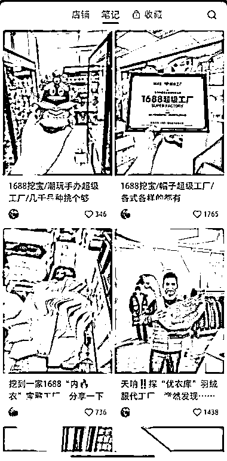
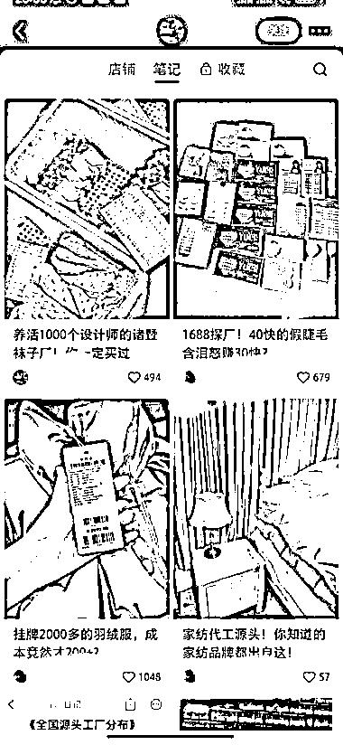
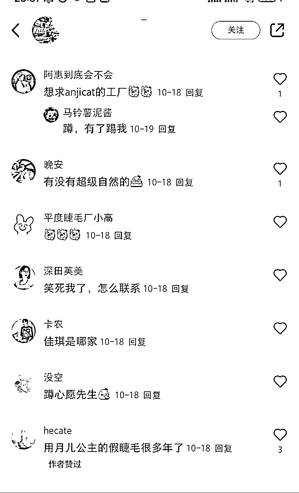

# 探厂笔记揭示供应商机会，小红书成为中间平台

> 原文：[`www.yuque.com/for_lazy/xkrm14/ncwyxe5tfw53x4v3`](https://www.yuque.com/for_lazy/xkrm14/ncwyxe5tfw53x4v3)

作者： 徐 Ken

日期：2023-12-25

点赞数：**40**

* * *

正文：

发布探厂笔记，做供应商，进行批量带货。发现小红书有不少博主发布探厂笔记（如图一和图二），点赞、评论和粉丝数都不错，相当于做中间的供应商，进行批量带货。笔记的评论有很多是求产品的（如图三），可见需求量不小。
可以根据抖音、快手、小红书等平台的销售榜单，寻找对应的厂家进行探厂，谈好合作方式。同时，在抖音、快手、小红书等平台开通店铺，或者直接寻找带货达人，给达人供货。

* * *

评论区：

爱拼才会赢 : 想要个关键词

徐 Ken : 探厂

徐 Ken : 多谢亦仁大大

* * *

公众号懒人找资源，懒人专属群分享