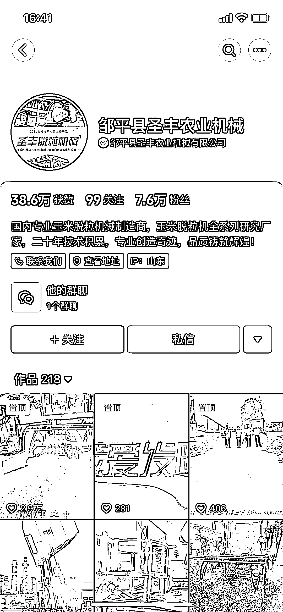
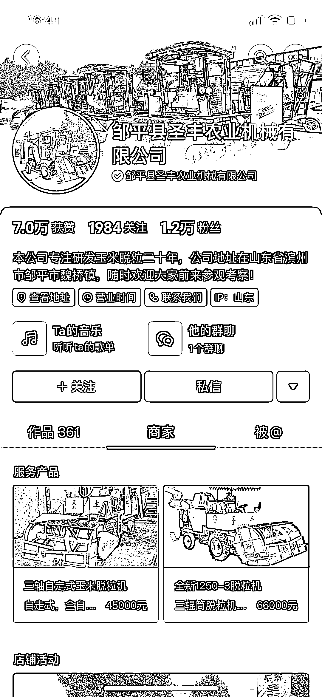
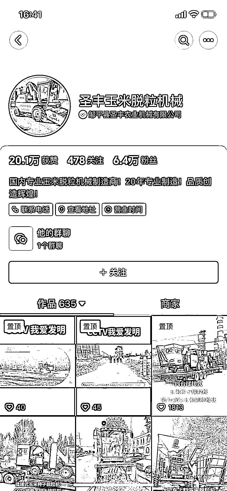
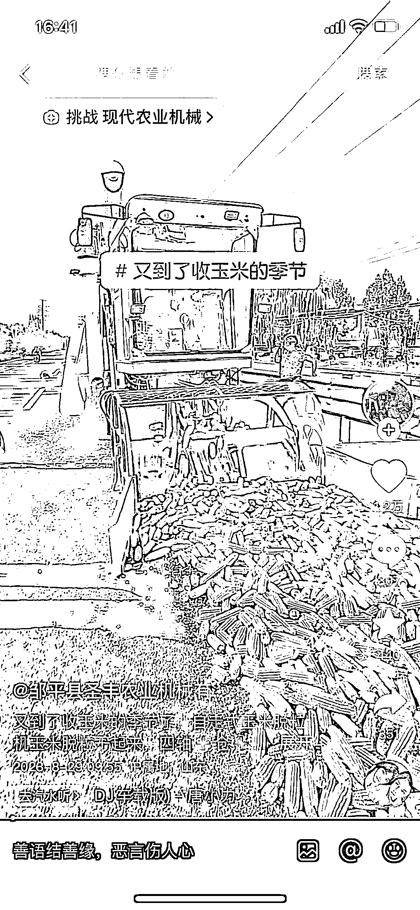
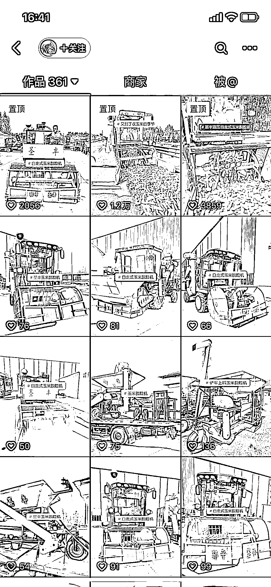

# 抖音矩阵化+SEO 优化：传统制造业农业机械领域的客户获取秘籍

> 原文：[`www.yuque.com/for_lazy/xkrm14/bvh1wuso8ighvy8f`](https://www.yuque.com/for_lazy/xkrm14/bvh1wuso8ighvy8f)

作者： 子凡

日期：2023-12-26

点赞数：**83**

* * *

正文：

传统制造业。农业机械领域 利用抖音矩阵化+SEO 优化的方式获取客户
线下见过老板 90 后，纯靠抖音获取客户，23 年卖了 500+辆车，营业额 4000w+，利润率 25% 传统制造业在抖音上依然还有蓝海市场待挖掘

* * *

评论区：

子凡 : 第一次上榜，感谢老大认可

希声 : [强]

* * *

公众号懒人找资源，懒人专属群分享