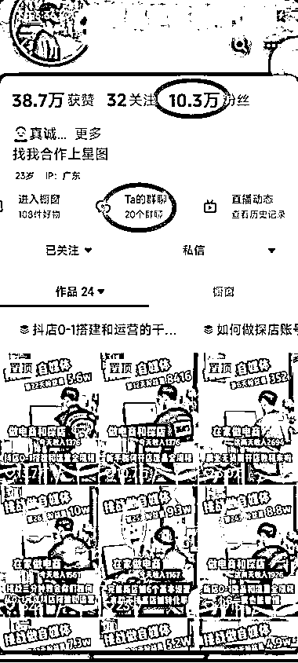
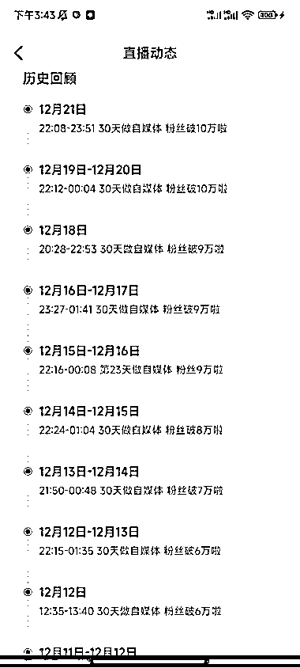
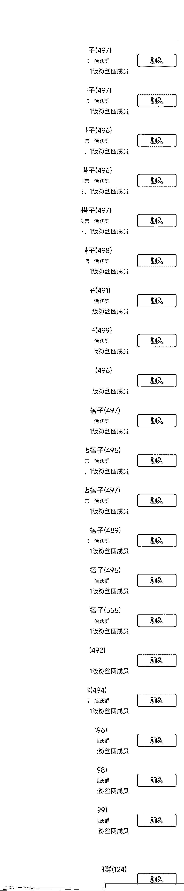

# 素人抖音号记录工作内容，涨粉 10 万，拥有 20 个 500 人粉丝群

> 原文：[`www.yuque.com/for_lazy/xkrm14/iic2yufxxhhzyd2x`](https://www.yuque.com/for_lazy/xkrm14/iic2yufxxhhzyd2x)

作者： 徐 Ken

日期：2023-12-26

点赞数：**90**

* * *

正文：

素人做抖音号，记录每天工作内容，涨粉 10 万，20 个 500 人粉丝群
在抖音刷到一个很不错的账号：素人 10 月 23 日从零起号，记录每天自己的工作内容，两个月时间做到 10 万粉（如图一）。因为是素人做起来的，让受众觉得自己也触手可及，另外，分享每天的工作内容，封面清楚地标出“第 X 天粉丝量 XXX，收入 XXX”，既满足受众的窥探欲，又能激发受众想跟着做项目的想法，更有利于引流转化。
同时，坚持每天直播（如图二），通过引入粉丝群（已经有 20 个群，如图三），导流到私域送项目资料。精准的创业粉，后续就可以嫁接很多变现项目。

* * *

评论区：

转角微笑 : 像一个连续剧

徐 Ken : 有道理，带着大家追剧😂

才 : 我在 b 站上做了一个类似的号，数据稀烂[撇嘴]

徐 Ken : 业绩不够吸引人？[呲牙]

钱哥老矣 : 人家投流了，你没投

徐 Ken : 高手。怎么从抖音主页看出这个账号是否投流了？

老张 : 这个我也有关注他这种模式，确实养成系列。

徐 Ken : 嗯，确实让人眼前一亮的起号方式，而且效果不错。

* * *

公众号懒人找资源，懒人专属群分享