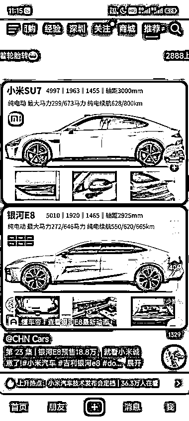
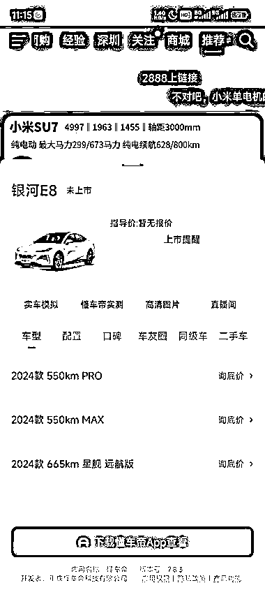
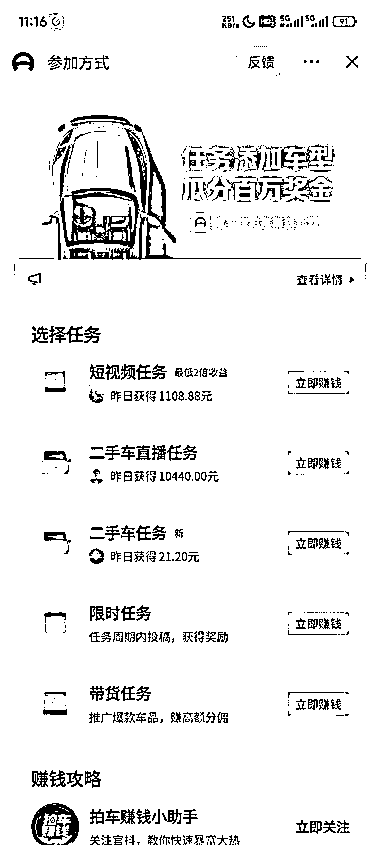
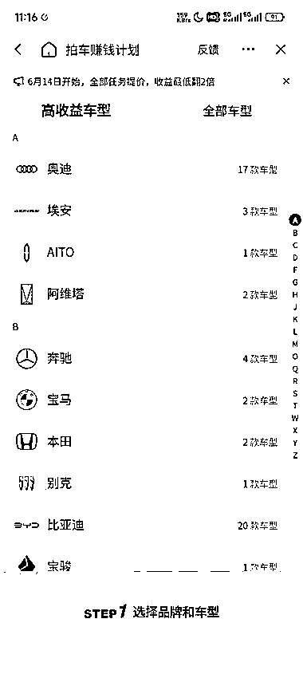
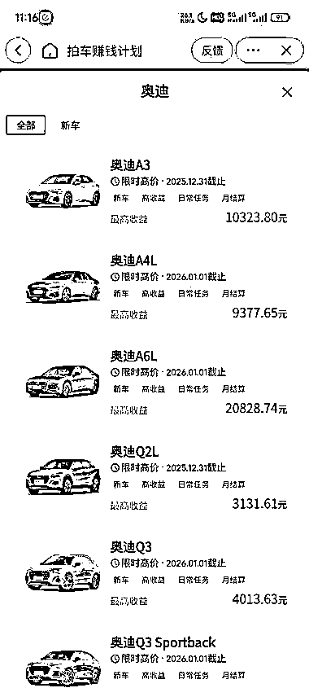
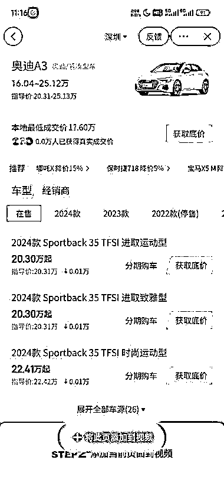

# 抖音小程序：挂懂车帝，赚取 APP 下载分成收益，创作热门车型作品引导用户下载

> 原文：[`www.yuque.com/for_lazy/xkrm14/pa404sn300ph65v8`](https://www.yuque.com/for_lazy/xkrm14/pa404sn300ph65v8)

作者： 三言

日期：2023-12-28

点赞数：**71**

* * *

正文：

抖音小程序的小众玩法： 挂懂车帝小程序，赚 APP 下载的分成收益，普通账号也是可以直接挂的，没什么要求。
作品的创作方向就是找最近比如热门要上市的车：比如小米汽车、华为问界、比亚迪等， 来进行混剪作品或者直接简单粗暴的发图文作品。
一些潜在对车型感兴趣的人，就会跟着视频的引导下载懂车帝 APP，路径非常丝滑。

* * *

评论区：

快乐柠檬 : 请问是用户下载注册后就有钱拿吗？还是用户通过这个 app 买车了，有佣金拿？

Northrp : 下了就有 买车也不会通过懂车帝啊

* * *

公众号懒人找资源，懒人专属群分享