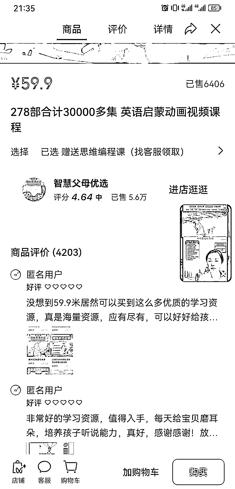
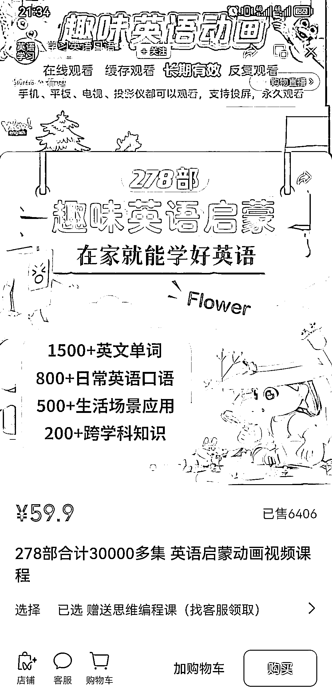
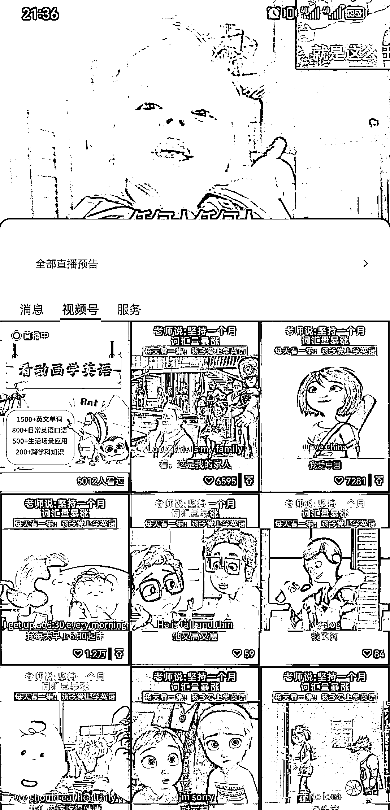
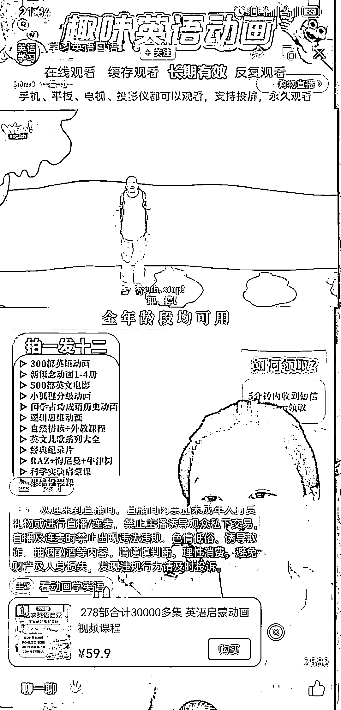

# 视频号卖英语启蒙动画视频课程电子资料，销售额达 38 万元

> 原文：[`www.yuque.com/for_lazy/xkrm14/mdgbzf2bslvrggle`](https://www.yuque.com/for_lazy/xkrm14/mdgbzf2bslvrggle)

作者： will 阿伟

日期：2023-12-26

点赞数：**84**

* * *

正文：

视频号卖英语启蒙动画视频课程电子资料，卖了 38 万元，客单价 59.9 元累积销量 6406，通过发布海外英语动画视频，点赞播放都挺高，引流直播间橱窗卖课

* * *

评论区：

Eric : 这个会存在版权问题么？

will 阿伟 : 不是迪士尼的应该没事

江大虾 : 需要授权

老张 : 这个是他挂别人的橱窗，不是他自己的店铺，但是他自己的店铺卖的更多，已经卖了 4 万多件，这个号我关注了挺长时间

秋闯 : 自己店铺需要什么营业范围

* * *

公众号懒人找资源，懒人专属群分享