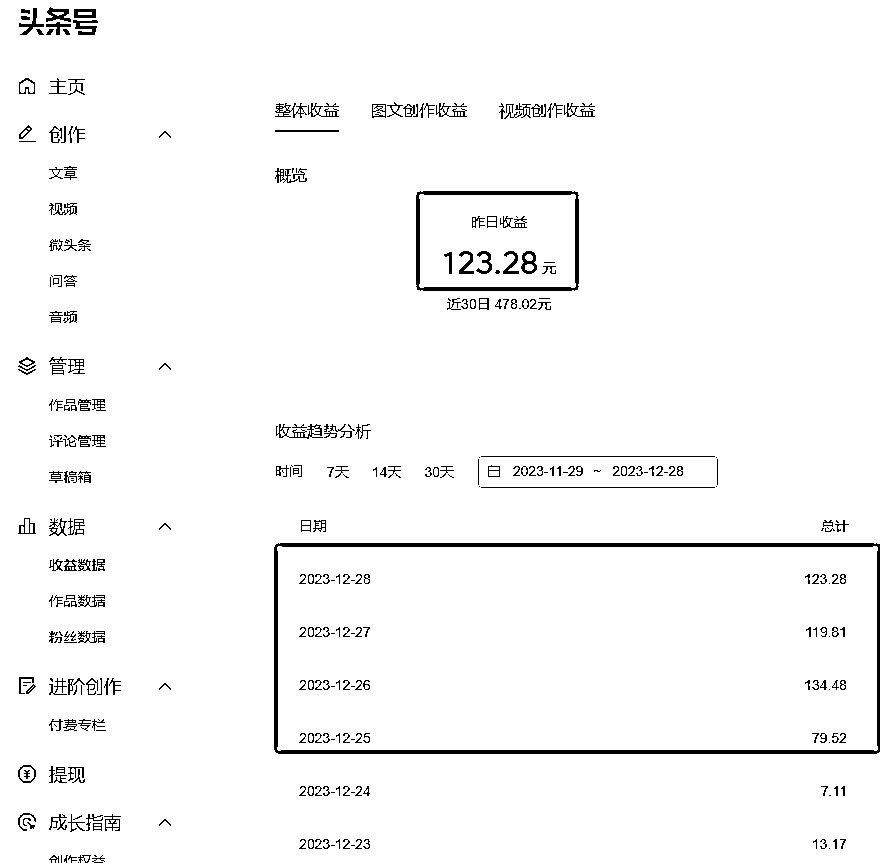

# 使用 ChatGPT3.5，新手每天仅花 1 小时更新，轻松赚取高额收益

> 原文：[`www.yuque.com/for_lazy/xkrm14/ohs2l7agyvhid3xb`](https://www.yuque.com/for_lazy/xkrm14/ohs2l7agyvhid3xb)

作者： 老彭（知识号是 vx）

日期：2023-12-28

点赞数：**250**

* * *

正文：

【ChatGPT+头条号】 “亦仁说：如果你是新手，没怎么赚到过钱，那优先选择门槛低长期空间不大的项目去拿正反馈，建立起信心很重要。”
这周才注册的新号，更新到第 3 天后，已经几十、上百收益一天了。用的 ChatGPT3.5，这几天我每天真的就仅仅花 1 小时更新，5 分钟一篇，1 小时 10 篇左右。我想说的是：
1、稍微懂点 GPT 的圈友，可以去试着做做（不懂就看手册），基本就是零门槛，但容易出正反馈
2、我截图的，只是在头条号更新，你可以完全一鱼多吃，同步到百家号、公众号，赚取更高额的流量费。
3、完全掌握后，可以横向拓展多个账号，矩阵上号，用 RPA 解决掉重复的工作，轻松赚钱
4、“没跑通 0-1 的伙伴要尽量在启动成本低的情况下去做一些平台型项目拿到结果”“绝大多数人应该聚焦在跑通赚钱闭环获得正反馈上”
（评论区附上发文时间截图验证：12 月 23 日才开始发的第一篇）

* * *

评论区：

林中灰兔 : 方便透露啥领域吗

老彭（知识号是 vx） : 附上发文时间，真的就是 12 月月底才开始发的

老彭（知识号是 vx） : 时尚哦

痞子叔 : 大佬，可以链接一下吗？

老彭（知识号是 vx） : 当然可以啊我的朋友们

望天吼 : 求链接

豆豆 : 微头条还是文章

AUDI : 手册链接是哪个呀

* * *

公众号懒人找资源，懒人专属群分享