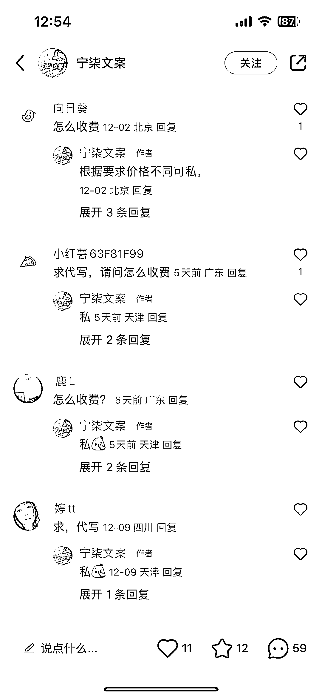
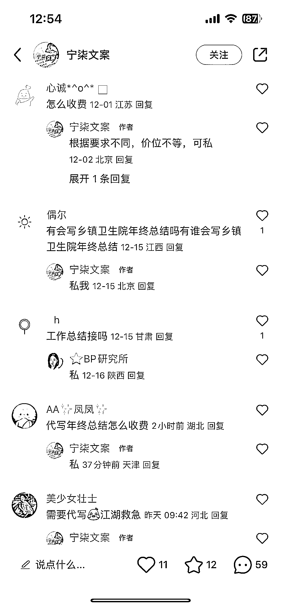

# AI 代写服务：年底工作总结、新年演讲稿、活动晚会流程等一应俱全

> 原文：[`www.yuque.com/for_lazy/xkrm14/hmxc5tr33m79uuqo`](https://www.yuque.com/for_lazy/xkrm14/hmxc5tr33m79uuqo)

作者： 皆顺

日期：2023-12-27

点赞数：**88**

* * *

正文：

AI 代写：年底工作总结、新年演讲稿、新年活动晚会流程、主持词代写、年底述职报告、2024 年工作规划、甚至年底相亲聊哪些话题、如何规避亲人盘问……
除了代写收费，也均可以引流到私域进行包年包月代写工作周记、月记、ppt。 我看了下小红书上面对这个的需要，粉丝量不用太多，但是都是精准引流。

* * *

评论区：

饭饭 : 这个最近的确很火，我们接单都有点忙不过来了

皆顺 : 棒棒的

* * *

公众号懒人找资源，懒人专属群分享