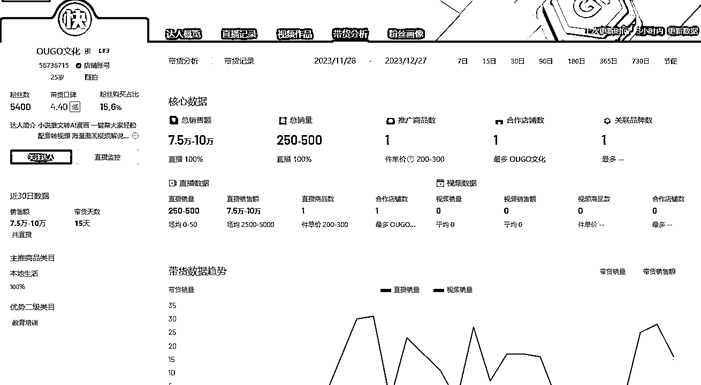
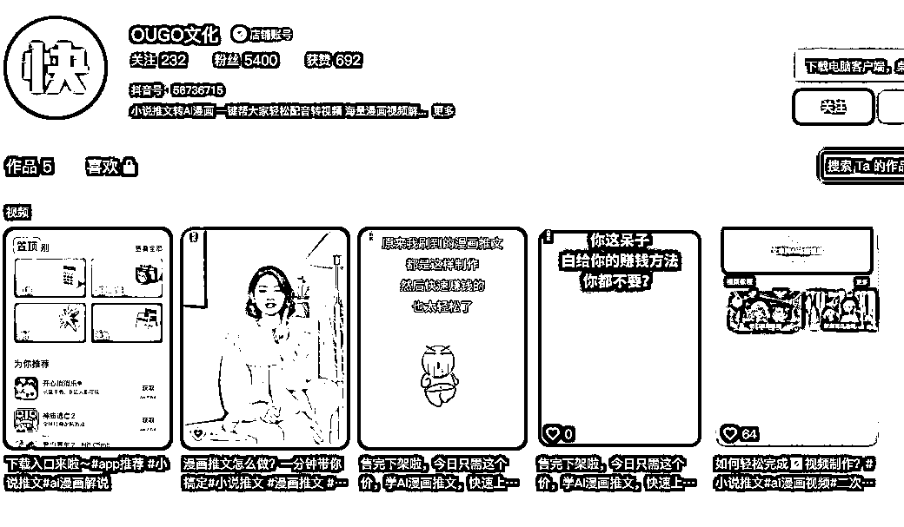
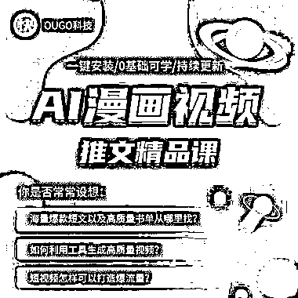

# AI 套壳软件：新的变现途径

> 原文：[`www.yuque.com/for_lazy/xkrm14/gy45zt3xrgx291em`](https://www.yuque.com/for_lazy/xkrm14/gy45zt3xrgx291em)

作者： 西昂

日期：2023-12-28

点赞数：**73**

* * *

正文：

这个账号很有意思，AI 套壳软件变现的又一个好途径。 自己做一个软件，然后直播引流卖课，送软件（注意：送软件） AI 漫画视频，最近是不是很火？好，教你！
很多人一看，这么牛！买买买！ 一个月卖了不到 10 万，成本给他算 1-2 万，到手纯利润 8 万左右。
想想以前风向标里面有个写公文的公众号很火，你看？是不是有点思路了？ 教你学公文，一秒 3000 字！ 给用户一个使用场景，他们就愿意给你掏钱了。
当然，店铺评分应该不高。[尴尬]

* * *

评论区：

* * *

公众号懒人找资源，懒人专属群分享