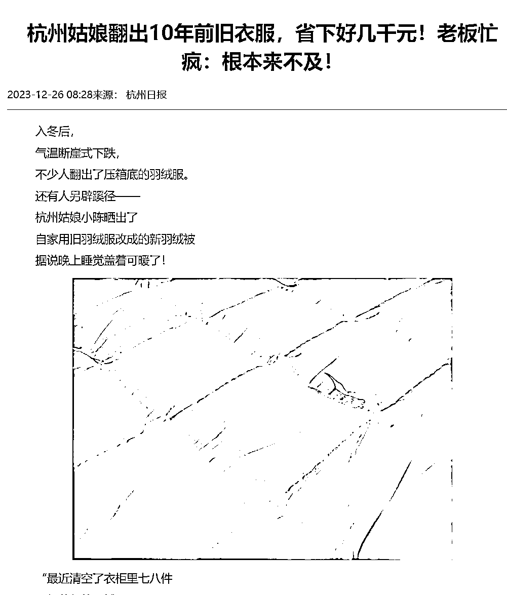
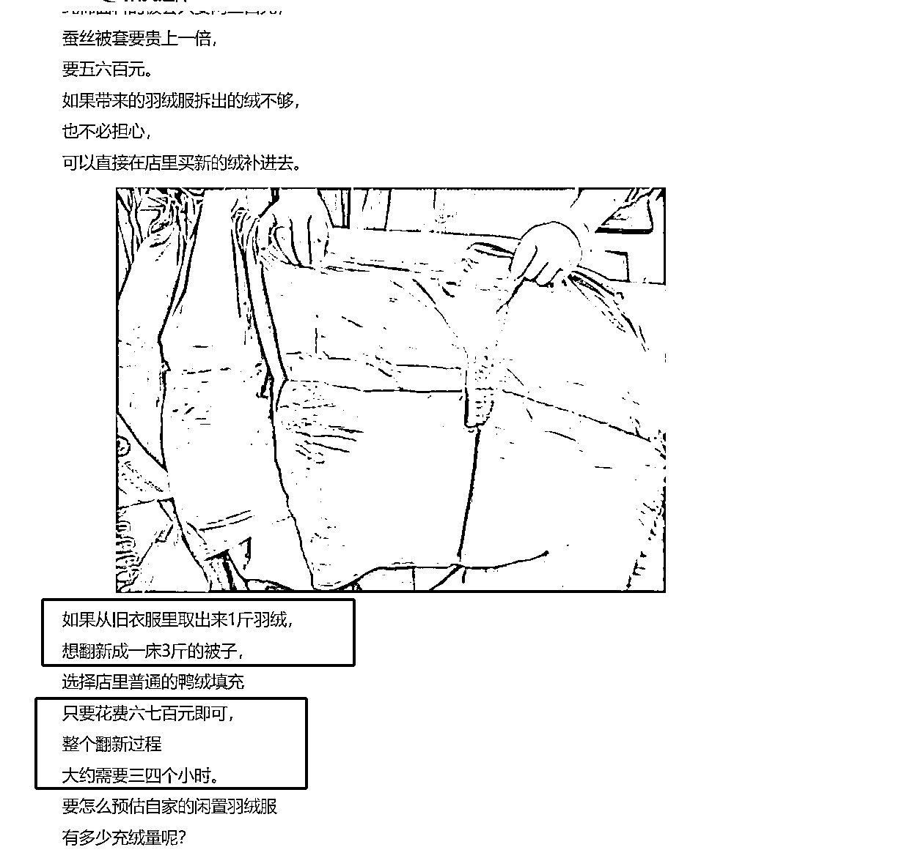
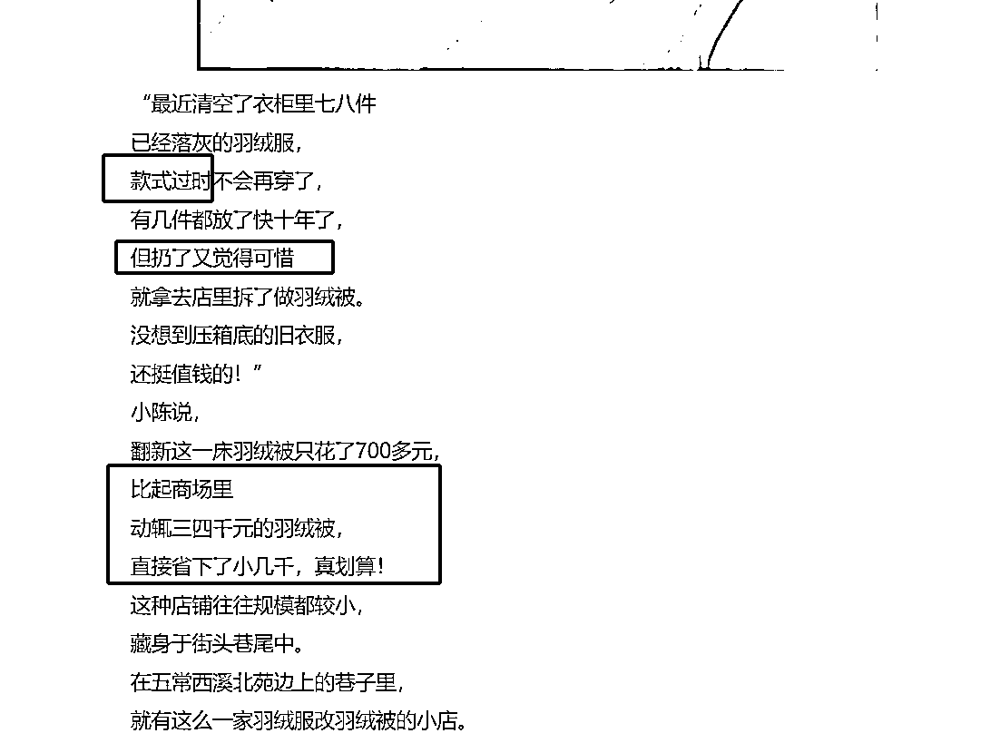
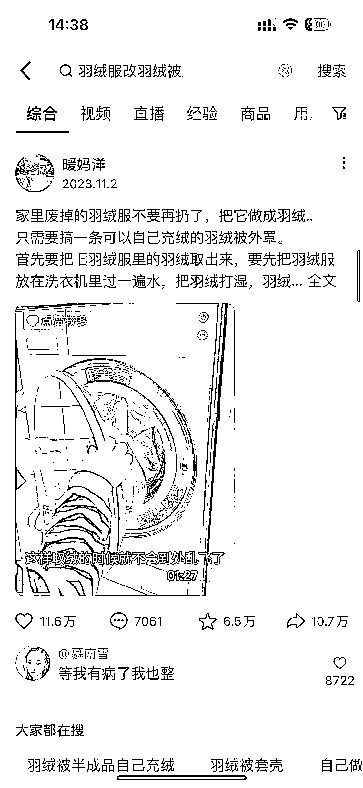
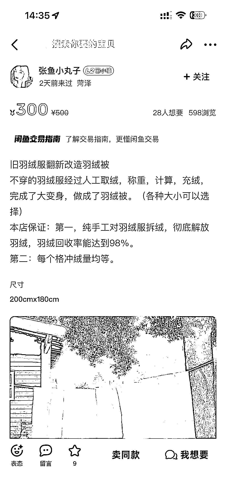
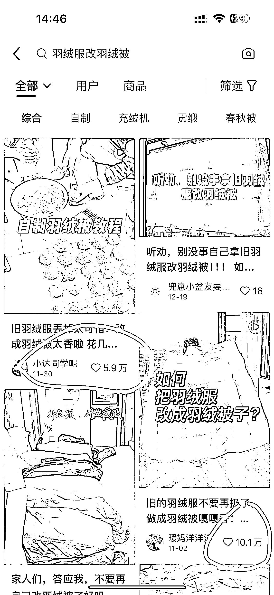
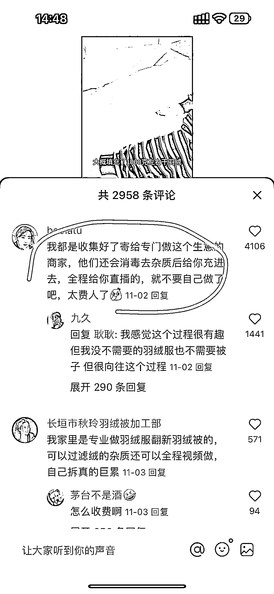
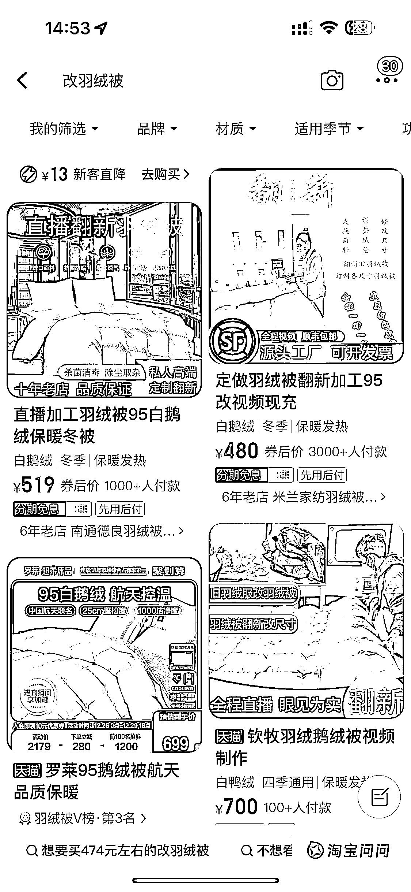

# 旧羽绒服改装羽绒被，赚钱机会来了！

> 原文：[`www.yuque.com/for_lazy/xkrm14/fnyw9cr6lg3y2dtt`](https://www.yuque.com/for_lazy/xkrm14/fnyw9cr6lg3y2dtt)

作者： 扯淡不打烊

日期：2023-12-26

点赞数：**74**

* * *

正文：

旧羽绒服回收利用衍生的赚钱机会 刚才刷到一条新闻，说是一女生把旧羽绒服拿去改装羽绒被省了几千元，于是检索信息发现了如下线索： 需求 1.羽绒服过时不想穿
2.羽绒服太久了不保暖 3.衣服没有坏不舍得扔 4.羽绒被很贵 于是可以把压箱底的羽绒服拆了再利用，买套新被罩就做成羽绒被了，省钱还解决了旧衣服的烦恼
后来去闲鱼搜索，发现比较小众的需求，也可能大家都不太知道，各种相关改羽绒被宝贝想要人不多
又去抖音和小红书搜了搜，发现有高赞视频，因为自己改造麻烦，高赞评论说有寄给专门的人的直播做，于是觉得可以通过直播和发视频改羽绒被来引流涨粉，通过互联网分一杯羽绒服改羽绒被的羹。
另外发现爆款视频有跟羽绒服改装相关的产品还不错，自己 diy 的小型充绒机 直接淘宝卖做好的改的羽绒被，几个链接都几千销量。

* * *

评论区：

朱朱侠 : 曾经开过做被子的实体店，棉花被蚕丝被羽绒被都做过，整体上确实是羽绒被的利润最高，也是最省事的

* * *

公众号懒人找资源，懒人专属群分享