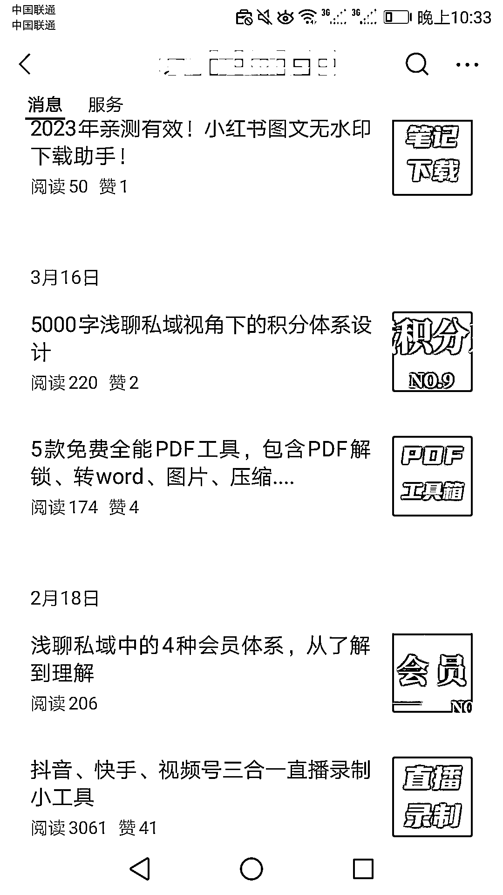
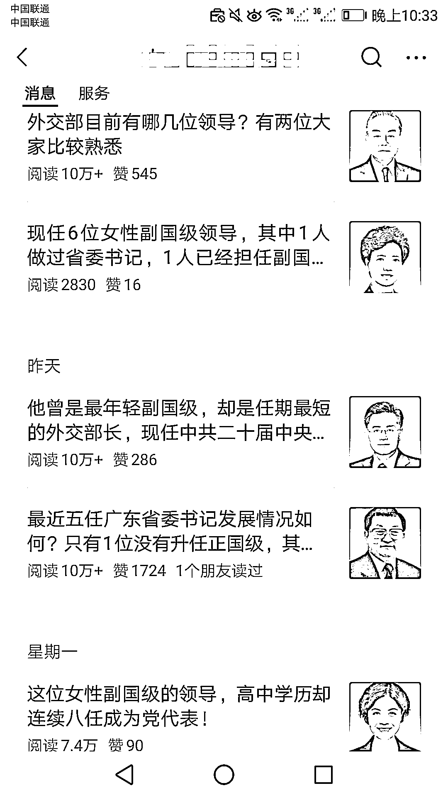
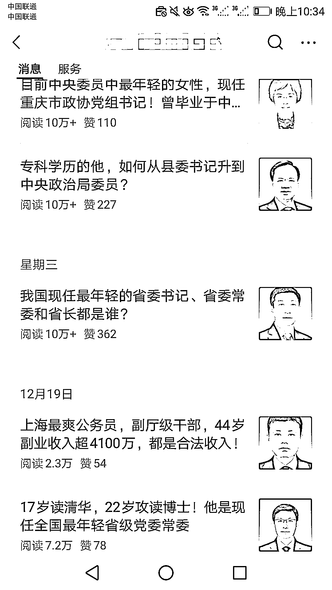

# 体制内题材文章表现出色，阅读量突破 10 万

> 原文：[`www.yuque.com/for_lazy/xkrm14/gep0em7tx9eg6iir`](https://www.yuque.com/for_lazy/xkrm14/gep0em7tx9eg6iir)

作者： 罗破帽

日期：2023-12-28

点赞数：**82**

* * *

正文：

这个博主之前写的是工具类题材的文章，数据平平。换成体制内题材的文章后，36 篇体制内题材的文章，12 篇阅读量 10w＋，16 篇阅读量过万。

* * *

评论区：

张小厨 : 估计也快要被谈话了，不得不说胆子太大～

计然 : 是

.踮起脚尖 : 为啥被谈话？

波哥 : 内容太敏感，轻则封号，重则约谈

Northrp : 这种钱不挣为好

* * *

公众号懒人找资源，懒人专属群分享