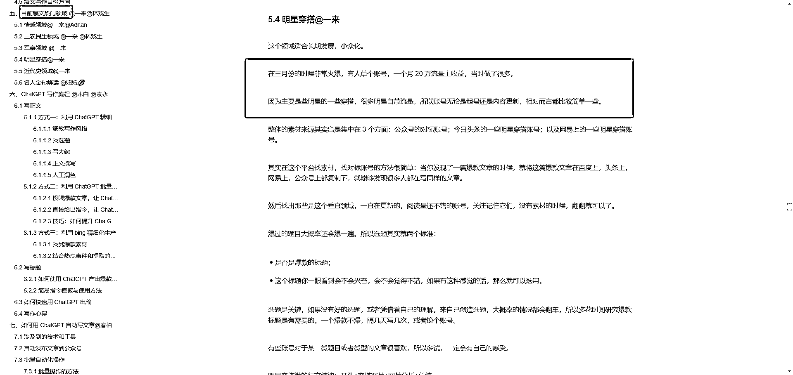

# 明星穿搭领域的写作 SOP，适用性依然强大

> 原文：[`www.yuque.com/for_lazy/xkrm14/wwyu1na05vkgtqnp`](https://www.yuque.com/for_lazy/xkrm14/wwyu1na05vkgtqnp)

作者： 老彭（知识号是 vx）

日期：2023-12-26

点赞数：**121**

* * *

正文：

如图，刷到圈友提及“明星穿搭”也是公众号爆文的热门领域，甚至有人单账号 20w 流量主收益！（应该有很多圈友心动了，且“明星穿搭”确实是这么多领域里，写作难度偏低而起号较快的...）
我 21 年也是做“明星穿搭”领域的，头条号百家号一年就薅了 50w+，还是有资格聊聊的。这是我当年做的写作 SOP（刷完贴翻出来的），很多头部账号也是用的这套。我说几点：
1、我刷了近一周头条号百家号公众号的爆款，这套 2 年前的写作 SOP 依然适用。
2、（当时是手写），现在很多圈友用 AI 创作了，完善正文内容时，可以借鉴观点用作 chatgpt 口令 ---
PS，我现在也还有做这些平台，不过我是用 chatgpt 写正文了，大概 5 分钟一篇，爆文率也还可以。希望这套写作 SOP 大家可以应用上吧，有什么不懂的可以评论区交流，或者直接找我...

* * *

评论区：

猫爸 : 朋友，可以加你微信吗？

胖大魔 : 朋友，可以加你微信吗？

小刀 : 这明星穿搭是本身流量就很高，还是这个账号做的好？

老彭（知识号是 vx） : 明星穿搭自带流量

老彭（知识号是 vx） : 大家都是朋友，别说这些见外的话哈

老彭（知识号是 vx） : 大魔！！！！！！！！！！！！！！！！！！！！！！！！！！！

老彭（知识号是 vx） : pq897456

* * *

公众号懒人找资源，懒人专属群分享