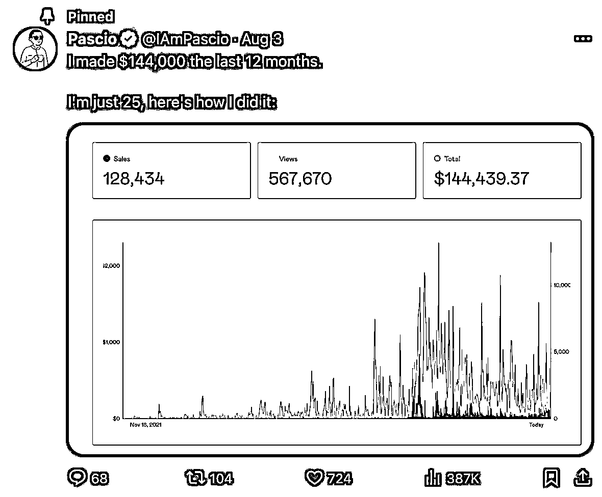
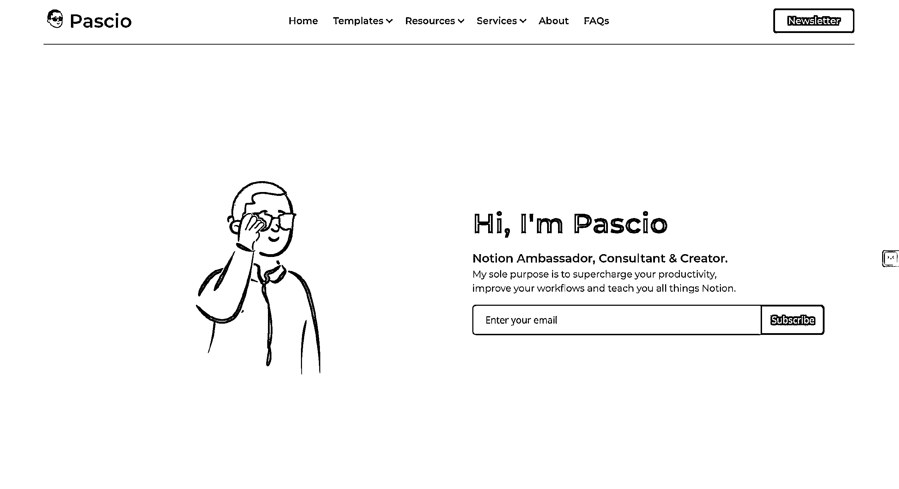

# 中东 Notion 创作者 Pascio：通过垂直领域模板赚取 14.4 万美元营收

> 原文：[`www.yuque.com/for_lazy/xkrm14/lomz30gdly7sydw3`](https://www.yuque.com/for_lazy/xkrm14/lomz30gdly7sydw3)

作者： 🐵Sunday🐵

日期：2023-12-28

点赞数：**60**

* * *

正文：

分享国外的 Notion 创作者：Pascio 1\. 推特粉丝数：10 万 2\. Instagram 粉丝数：4k 3.
在 Facebook 有一个 9k+人的 Notion 群组 4\. Producthunt：4000+粉丝； 5\. 网站每月 PV：不到五千 6.
网站访问主要人群：18-34 岁； 7\. 网站流量主要来源：推特、Facebook； 8\. 2022.8-2023.8 年营收: 14.4 万美元。
Pascio
是一名中东人，从 2022 年开始做 Notion 创作者，从垂直场景出发做模板，选择在 facebook 建立免费 Notion 模板群组来积攒流量，一年时间营收达到了 14.4 万美元....
不过，收入的构成并不全是卖模板，当 Pascio 推特粉丝数变多之后，他开发了一门课程，教别人如何通过做 Notion 创作者挣钱，现在这门课程也是他 Gumroad 店铺上的热销产品。（果然还得是教别人赚钱自己赚钱啊😂）
但是有两点非常值得我们借鉴： 1\. 选择一个垂直领域做模板； 2.
不是一味地靠堆内容来做流量，而是搭配合理的增长策略：Fb 免费模板群组、PH 打榜等，在更短的时间内完成快速增长。
Notion 模板也能 PH 打榜，我想这应该是颠覆了很多人的认知....

* * *

评论区：

北国 : 中东人，差点看成山东人[呲牙]

希声 : 666

* * *

公众号懒人找资源，懒人专属群分享