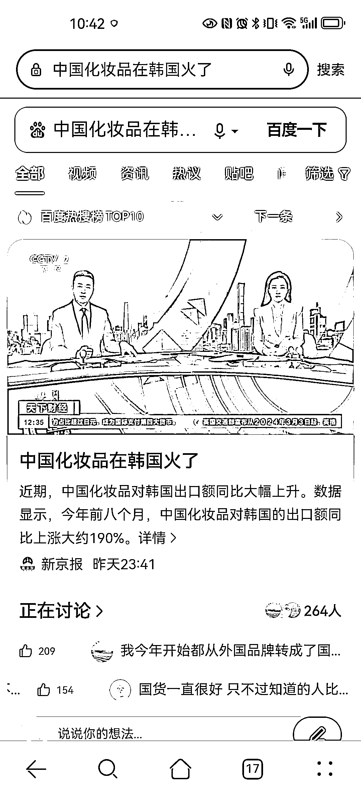

# 中国化妆品对韩国出口额暴涨 190%，中低价产品受欢迎

> 原文：[`www.yuque.com/for_lazy/xkrm14/ygvodo2maawyexw4`](https://www.yuque.com/for_lazy/xkrm14/ygvodo2maawyexw4)

作者： 华闻

日期：2023-12-25

点赞数：**41**

* * *

正文：

今年前 8 个月，中国化妆品对韩国的出口额暴涨 190%，这数字震惊。 原因：
受物价上涨影响，韩国消费者在化妆品上支出减少。相比高端化妆品，消费者更爱买性价比高的中低价化妆品。 机会： 做跨境的选品，贸易，内容上赶紧抓住这波机会

* * *

评论区：

* * *

公众号懒人找资源，懒人专属群分享