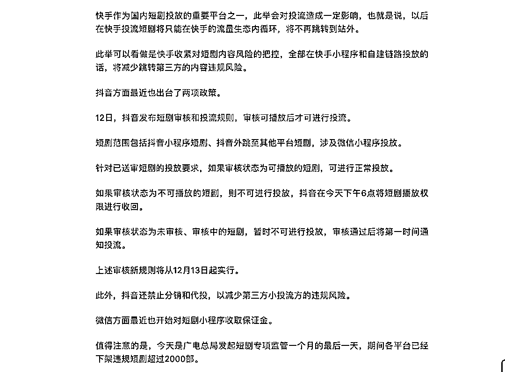

# 快手宣布停止第三方微短剧小程序商业推广和投放，广告主可迁移到快手小程序进行投放

> 原文：[`www.yuque.com/for_lazy/xkrm14/gbmeu85otv56x8yk`](https://www.yuque.com/for_lazy/xkrm14/gbmeu85otv56x8yk)

作者： 0x557

日期：2023-12-28

点赞数：**58**

* * *

正文：

快手将于 12 月 31 日 20:00 正式停止第三方微短剧小程序的商业推广和投放。
快手官方称，从 12 月 22 日起，第三方小程序微短剧广告主可逐步迁移到快手小程序以及快手自建链路进行投放，期间，为了降低迁移对广告主的影响、保障投放效果，快手平台将给予一定的政策扶持。

* * *

评论区：

* * *

公众号懒人找资源，懒人专属群分享