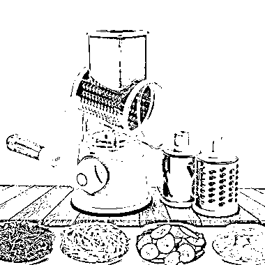
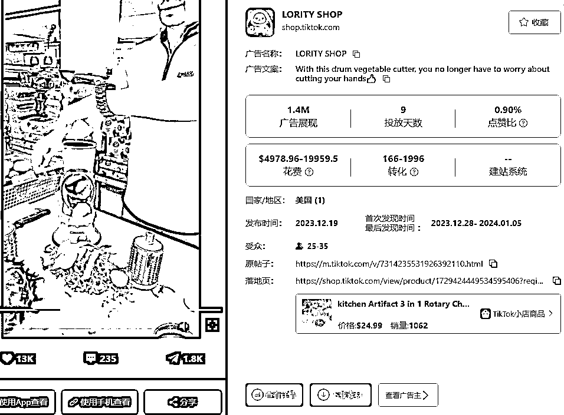
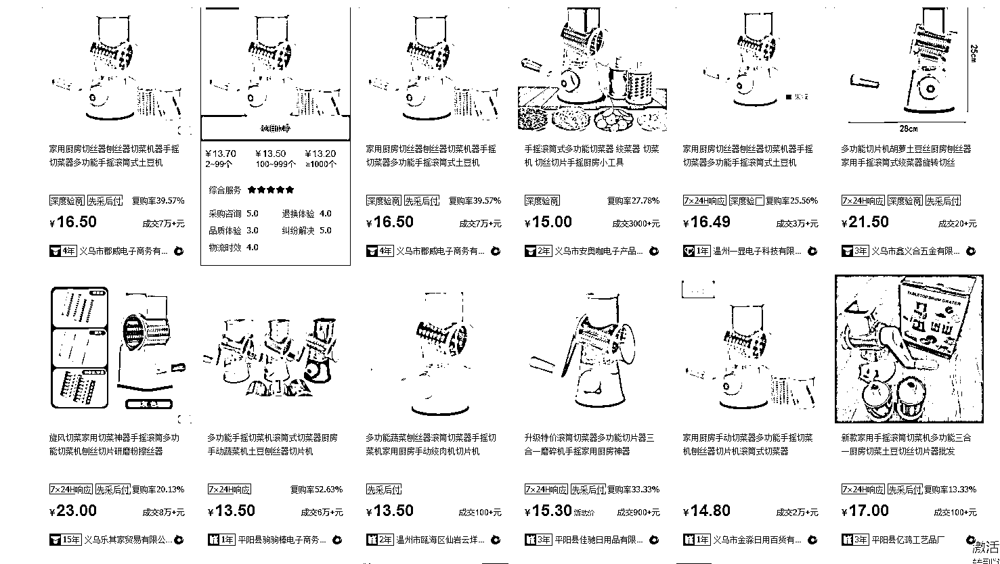

# Tiktok shop 上的厨房好物，单周千单，利润空间大

> 原文：[`www.yuque.com/for_lazy/xkrm14/ugdgib66l4t0lh3s`](https://www.yuque.com/for_lazy/xkrm14/ugdgib66l4t0lh3s)

作者： Max

日期：2024-01-05

点赞数：**65**

* * *

正文：

通过投放在 Tiktok shop 单周千单的厨房好物。
通过 pipiads 抓取到的数据显示，该商品在 12 月 28 日开始投放，目前单条广告 140 万的广告展现，销量为 1062 单。在 TikTok
Shop 的价格为 24.99 美刀
在 1688 上找到同款产品价格为 15 元左右。有较大的利润空间。很多厨房好物可以用很简单直接的素材呈现。高刚需低门槛，大家可以看看这方面的产品。

* * *

评论区：

波叔 : 毛利润大概 20000-25000 刀，去除投放成本 5000-19000 刀，还要祛除人工、运营成本等，如果没有较高复购，其实收益率并不太高

哓 海丶 : 运费就不低

徐丹-超级丹 : 思路学习了 谢谢分享哈

快乐柠檬 : TK 可以像抖音那样达人带货拿佣金吗？比如短视频挂车拿佣金

米多利 : 可以

* * *

公众号搜索，懒人专属群分享