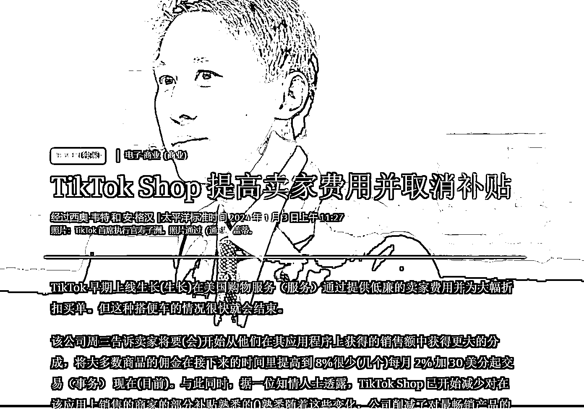

# TikTok 商店将上调销售佣金并削减部分补贴

> 原文：[`www.yuque.com/for_lazy/xkrm14/gbod2d95yu0a9egx`](https://www.yuque.com/for_lazy/xkrm14/gbod2d95yu0a9egx)

作者： 李瑞腾

日期：2024-01-04

点赞数：**27**

* * *

正文：

TikTok 商店将在美国上调销售佣金并削减部分补贴 The Information 网站，1 月 3 日消息，TikTok 发给美国卖家的信息显示，TikTok
将在未来几个月内把美国应用内销售佣金从 2%上调至 8%，并削减对卖家的部分补贴。TikTok
发言人向卖家证实了这一消息。据悉，佣金将分阶段上调，大部分销售的佣金将在 4 月 1 日上调至 6%，然后在 7 月 1 日上调至 8%。而针对卖家的补贴将仅限于最畅销商品。

* * *

评论区：

* * *

公众号搜索，懒人专属群分享