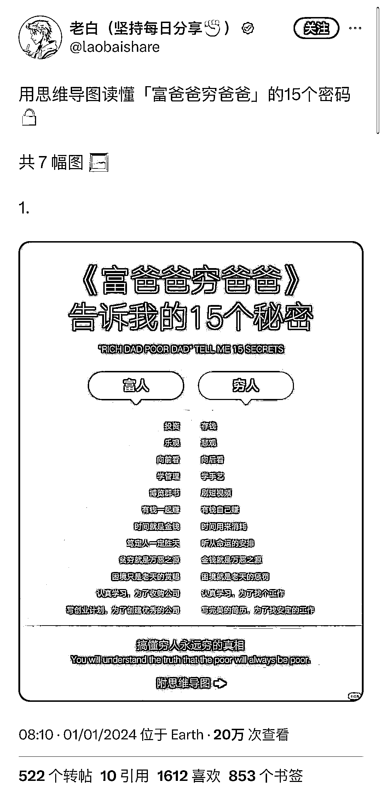
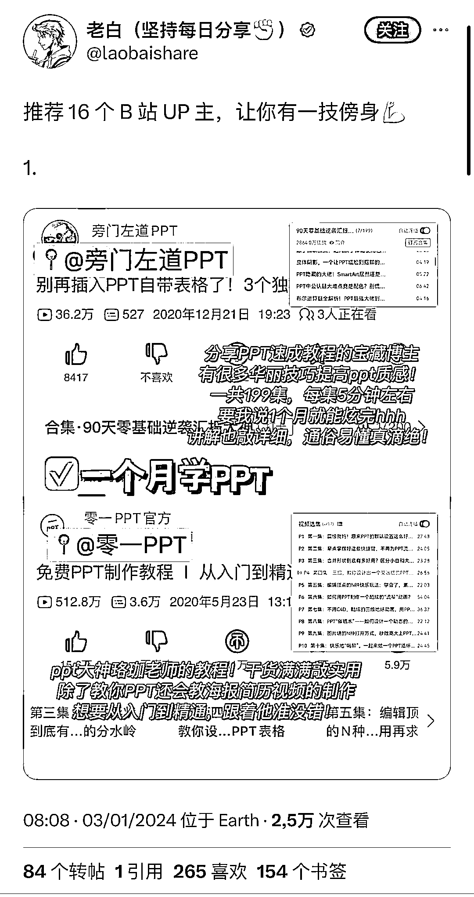
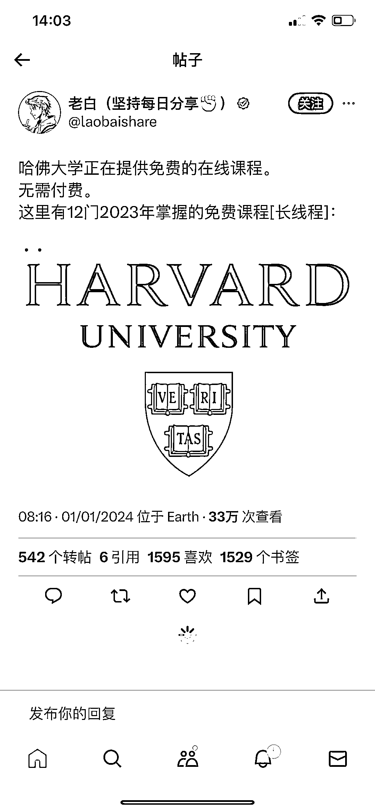

# 小红书内容在 X 平台引起反响，圈友建议协同使用以保护劳动成果

> 原文：[`www.yuque.com/for_lazy/xkrm14/ca2b6x8gy6auclbg`](https://www.yuque.com/for_lazy/xkrm14/ca2b6x8gy6auclbg)

作者： 林林 AIGC 写作

日期：2024-01-03

点赞数：**85**

* * *

正文：

小红书的内容搬运到 X（原 Twitter）平台，没想到反响挺不错的。对于在小红书拿到结果的圈友来说，有条件的话还是尽量跟 X 也协同一下，以免自己辛辛苦苦的劳动成果就这么被人搬到外网，作为给他们引流的工具。

* * *

评论区：

奈斯儿 : X 上咋变现呢

林林 AIGC 写作 : 站外变现 流量变现

小王 : 一直没想到怎么变现[呲牙]

佐敦道 : 搬过，很爆，变现没处理好

速影 : 像卖货类的内容能翻译成英文搬运上去嘛？

佐敦道 : 都可以，流量肯定没问题

* * *

公众号搜索，懒人专属群分享