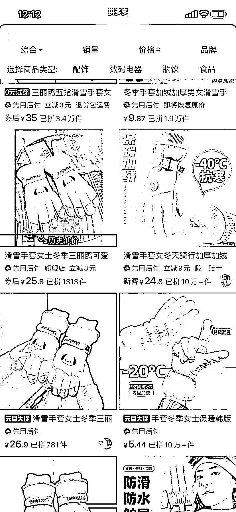

# 小红书上手套销量火爆，揭示年轻女性审美和利润空间

> 原文：[`www.yuque.com/for_lazy/xkrm14/zxx7ocuqsbb0c17r`](https://www.yuque.com/for_lazy/xkrm14/zxx7ocuqsbb0c17r)

作者： 🔥鲁多福

日期：2023-12-29

点赞数：**61**

* * *

正文：

小红书上这个号粉丝 1500 不到，所有的笔记都是发手套的实拍图。 但是手套销量不错，第一款图片销量 3 万多，售价 38.8 元，PDD 上售价 30 元左右。
小红书上都是有一定审美的年轻女性，卖一些有美感，售价 50 元左右的生活小物件，无货源一件代发，还是挺大利润空间的。

* * *

评论区：

🔥鲁多福 : 感谢亦仁大大！

路 : 货源独家，这个产品有授权的，这个账号我从一开始卖几百双的时候就关注了，我也跟了一段时间，笔记也能爆，无耐找不到货源。只有他家有。

🔥鲁多福 : 这样子，这个思路可以做其他产品嘛

* * *

公众号搜索，懒人专属群分享