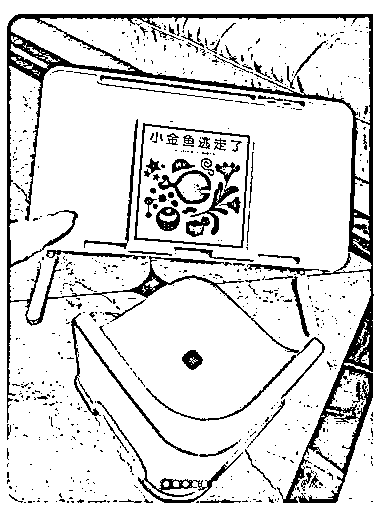
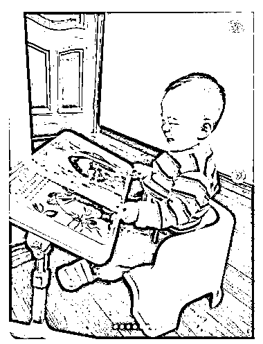
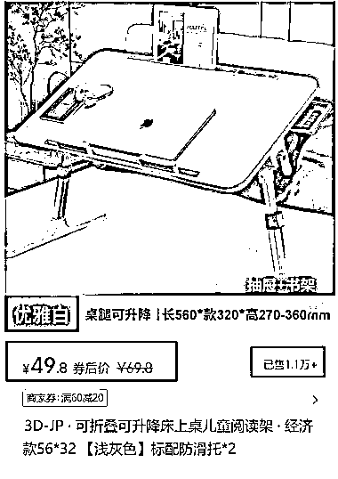
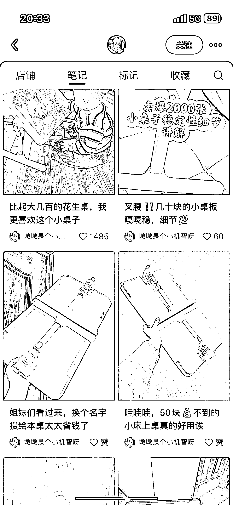

# 小红书上销售小孩子升降阅读架的笔记，客单价 49.8 元，销量 1.1w+

> 原文：[`www.yuque.com/for_lazy/xkrm14/ytd42m0rn2i8or2d`](https://www.yuque.com/for_lazy/xkrm14/ytd42m0rn2i8or2d)

作者： 老金

日期：2024-01-05

点赞数：**80**

* * *

正文：

在小红书上刷到销售小孩子升降阅读架的笔记。 拍摄方式：实拍+孩子真人出镜（图 1，图 2） 客单价：49.8 元，销量：1.1w+，销售额：54W+（图 3）
博主是个普通宝妈，所有笔记都是同一类（不同场景使用升降阅读架），很容易模仿。（图 4）

* * *

评论区：

波叔 : 这个可以有

光追 20220908 : 说句题外话，这种小桌子我算是比较有发言权了，就这种而言，不推荐给小宝宝用，这种形式的我买的 200 多元的都巨难受，非常反人类的设计，而且很容易晃动，对看书来说，影响视力是大忌。同时不一会儿你的脖子和腰会非常难受，也就适合偶尔看看大板书，随便翻翻的。对于材料的气味，是否环保，回收料等问题。当然这是产品的题外话了。家里有宝宝的不要考虑这种形态的产品，只有坏处，没有好处。

才 : 我个人认为，这条信息给我的价值是他山之石可以攻玉，主要是她的拍摄形式，简单高效，她就买一个品各种角度拍，这样节省了样品的物料成本和拍摄成本，然后是她选的品，质量好不好先不讨论，但是她抓的点很好，在加上孩子的使用场景，你是宝妈你看了估计也会买，人群精准

xing : 商业的角度，有建设性的角度

小刀 : 这个东西一看照片就是不结实的，卖这个就是割韭菜用的，赚一次钱，也不打算要回头客。作为消费者买回去之后要么退货，要么就认了。

徐丹-超级丹 : 我买过 后面退了 还想买😂

老金 : [抱拳][憨笑]

* * *

公众号搜索，懒人专属群分享