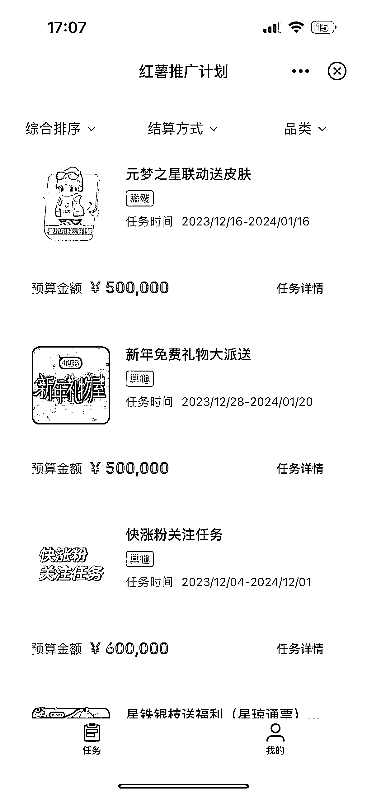
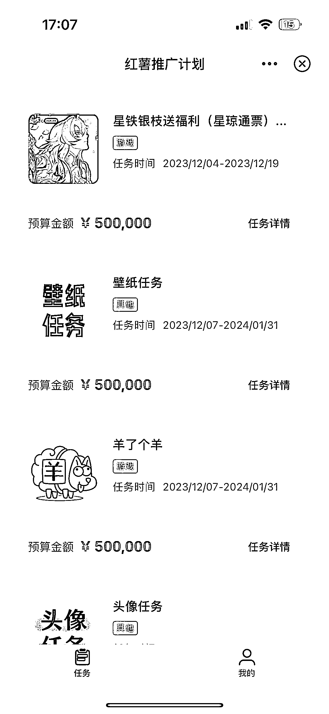

# 小红书全民推广玩法：高达 40 元-人的邀请奖励和达人瓜分奖励

> 原文：[`www.yuque.com/for_lazy/xkrm14/wqmv2pczbp0rhy1h`](https://www.yuque.com/for_lazy/xkrm14/wqmv2pczbp0rhy1h)

作者： 橘子小姐

日期：2024-01-04

点赞数：**32**

* * *

正文：

小红书的全民推广玩法 主要是两个玩法 第一个是邀请没有注册小红书的用户使用小红书，最高单价可以给到 40 元/人
第二个是类似全民众包 APP 推广的玩法，比如网易有款游戏上线了 然后可以在小红书发布引导注册下载的任务，总金额一定由达人瓜分，谁邀请的多谁获得的奖励就多。
过几天可能就会在各大街头看到注册小红书送大鹅或者鸡蛋/小米的活动了。

* * *

评论区：

风雨彩虹🌈 : 请教下在哪里呢，没有找到全民推广的入口呀

马先生 : 这个从哪能看的？是邀请制，你看看小红书后台消息，有的话就扫那个二维码进群，下一步填报小红书信息，下一步审核，审核通过就可以推广

* * *

公众号搜索，懒人专属群分享