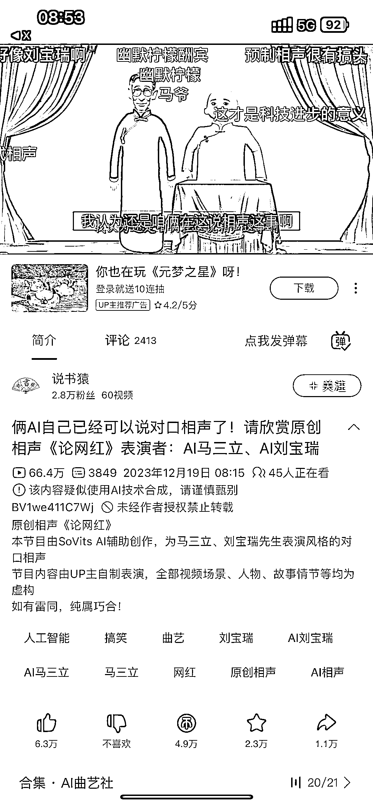

# AI 相声：用 AI 创作脚本，生成动画，66 万播放

> 原文：[`www.yuque.com/for_lazy/xkrm14/dmo3izsso3lrtn13`](https://www.yuque.com/for_lazy/xkrm14/dmo3izsso3lrtn13)

作者： 叉叉敌

日期：2024-01-02

点赞数：**82**

* * *

正文：

ai 相声，用 AI 写好脚本，用 AI 生成动画 66w 播放，其他平台没看

* * *

评论区：

胡亚雄 : 这个怎么做，有教程吗

叉叉敌 : 如果有点编程基础，不难

兰心 : 这个厉害了

蒋鑫 : 会不会涉及肖像权的问题

叉叉敌 : 不会的，放心吧

Bernie Fu : 有意思，准备研究下

* * *

公众号搜索，懒人专属群分享