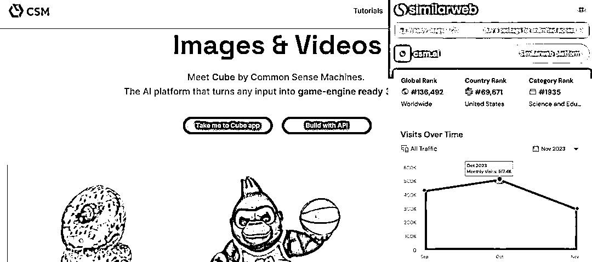

# AI 工具 CSM：将照片和视频转化为 3D 世界

> 原文：[`www.yuque.com/for_lazy/xkrm14/yk0xu98zzaeqe2sn`](https://www.yuque.com/for_lazy/xkrm14/yk0xu98zzaeqe2sn)

作者： 苓枫

日期：2023-12-29

点赞数：**50**

* * *

正文：

AI 3D 素材生成 分类：AI 工具 网址： 流量：30.2 万/月 介绍： 其实 MJ V6 生成的更好，可以直接生成好后用来刻模了 Prompt： A
highly detailed 3D render of [需要生成的物品] isolated on a white background as an
RPG game asset, unreal engine, ray tracing --ar 3:2 --v 6.0 游戏行业，还是刺激的
另外一个游戏行业 AI 素材 流量：1330 万/月[CSM — Turn photos and videos into 3D worlds](https://www.csm.ai/) 

* * *

评论区：

城市隐者 : 这个信息差[强]

* * *

公众号搜索，懒人专属群分享