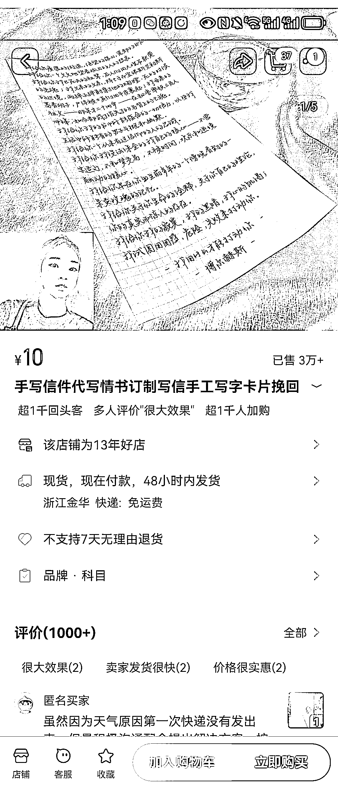
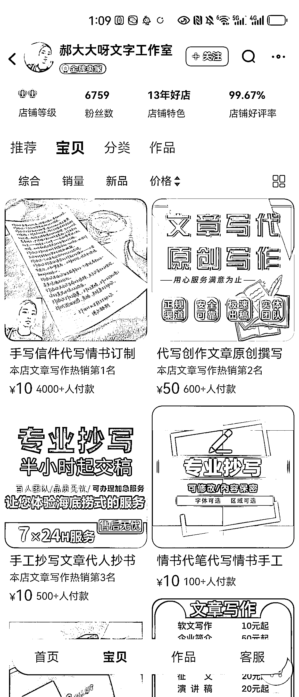

# 代写信利润高，专门对接写手，字迹要求高

> 原文：[`www.yuque.com/for_lazy/xkrm14/okecszi6e4fkozw9`](https://www.yuque.com/for_lazy/xkrm14/okecszi6e4fkozw9)

作者： 程哥虚拟电商

日期：2023-12-29

点赞数：**62**

* * *

正文：

代写信一年可以干 50-100w，只做抄写利润一般，但是写信利润高，这个可以专门对接写手
，你可以代写找一个人，写好后找另外一个人来抄，因为写信客户对字迹要求也相对高！写手可以从闲鱼找。

* * *

评论区：

💖善士笔记💖 : 这个有手写机器人

程哥虚拟电商 : 有 ， 机器人写的看的出来

狗娃子 : [偷笑]能不能用 gpt 生成文案，然后找个人抄抄

程哥虚拟电商 : 可以 人工修改+智能

* * *

公众号搜索，懒人专属群分享