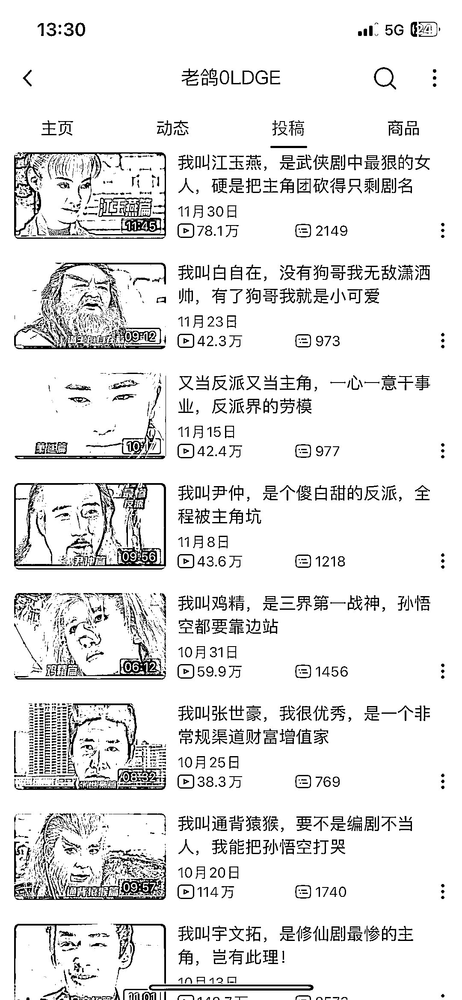

# 反派角色的成长之路，自我吐槽段子视频带来回忆杀

> 原文：[`www.yuque.com/for_lazy/xkrm14/dmibyrhz51itraai`](https://www.yuque.com/for_lazy/xkrm14/dmibyrhz51itraai)

作者： 蚂蚱有计

日期：2023-12-29

点赞数：**61**

* * *

正文：

都说反派角色才是努力上进一步一步成长起来的，所以可以把很多电视剧从反派或者有共鸣点情绪的角色代入，重新剪辑一个自我吐槽的段子视频。自带槽点满满+回忆杀，可以挂橱窗卖复古产品，以及零食。

* * *

评论区：

张老三 ཌ : 这个好，光看标题就想点进去

蚂蚱有计 : 是，很容易出不来[捂脸]

BLUE : 哈哈哈，哥们你也看完了

蚂蚱有计 : 😅你、你、你偷窥我！

蚂蚱有计 : 🫰

倪大胖 : 怎么做到这么大的脑洞的

蚂蚱有计 : 换个角度，现在哪个主角不是光环过盛？况且任何电视剧里都有一个迷人的反派角色，或者更加有共鸣的角色让人鸣不平，或者是高智商冷酷男二，尤其日漫二次元人物设定，自带粉丝，讨论区各种鸣不平。你只要代入即可，当然文案需要得点功夫更加接地气。

* * *

公众号搜索，懒人专属群分享