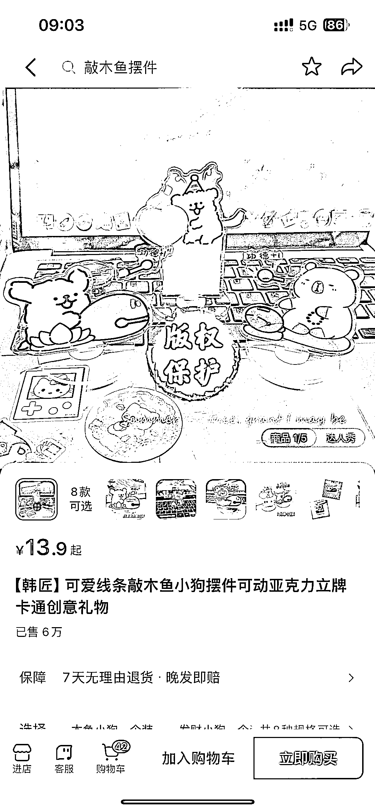
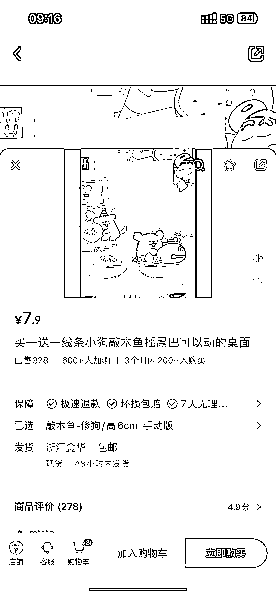
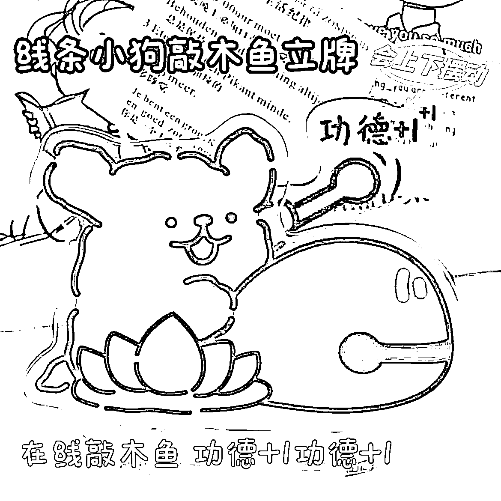

# 线条小狗：抖音销量 6w，小红书加购 600 人，商机可期

> 原文：[`www.yuque.com/for_lazy/xkrm14/llyg3l0qbbsla4fu`](https://www.yuque.com/for_lazy/xkrm14/llyg3l0qbbsla4fu)

作者： 小丸子

日期：2024-01-04

点赞数：**77**

* * *

正文：

爆品分享：线条小狗。 抖音销售量 6w，大约 60wGMV+。小红书目前 600 人加购物车。说明抖音的品搬运到小红书依然奏效/可行。
这玩意 1688 也就七块钱，算下来最起码 30w 的收益。 但是，小红书目前商业化基建还是一块待开发洼地。值得一做。但抖音和小红书的内容创作方向会有些略微差异。
也很符合亦仁第二期风向标拆解计划的第一个选题，在小红书做礼物生意是不是一门好生意，当然是。 有供应链的哥哥姐姐们也可以下场做，有机会一起玩。

* * *

评论区：

boarding : 怎么确定人家有没有投流？

小丸子 : 确定不了，我没实操这个品，只是觉得小红书，抖音都可以卖，拿出来分享给大家。

潮州痞子蔡 : 这个不关键，因为如果投也是说明能赚回来，关键品有大需求就行

小丸子 : 也就过去一天，又出了 2000 单。我对抖音的力量一无所知。

* * *

公众号搜索，懒人专属群分享