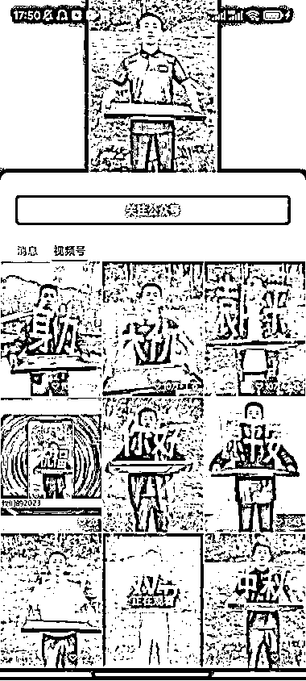
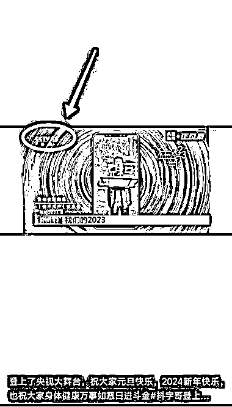
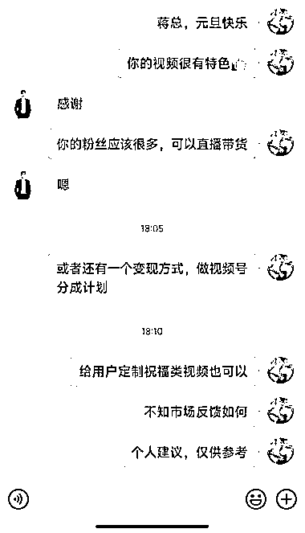

# 用米造字拍视频，频繁出现 10 万+点赞爆款

> 原文：[`www.yuque.com/for_lazy/xkrm14/yp7kmwkopbm0gxmd`](https://www.yuque.com/for_lazy/xkrm14/yp7kmwkopbm0gxmd)

作者： 徐 Ken

日期：2024-01-02

点赞数：**59**

* * *

正文：

用米造字拍视频，频繁出现 10 万+点赞爆款。
刷到一个很有特色的账号：用大米或玉米摆出汉字，放在木质托盘上，然后借助托盘把米甩起来，向观众显示出摆出的汉字，如图一所示。
浏览了账号主页，发现有不少 10 万+点赞的视频，（如图二所示），可能这类视频在平台属于新奇特的内容，容易得到推荐。令人意外的是这个博主竟然通过这样持续拍视频，登上了央视 13 频道（如图三所示）。
这种视频的制作成本不高，几个木质托盘和一些大米或玉米即可。做熟练了，估计 15 分钟一个视频。然后，我这躁动的心又厚着脸皮给对方建议变现方式（如图四所示）：定制祝福视频，有一定粉丝量以后可以直播带货，或者做视频号分成计划。也不知道会不会被骂[偷笑]

* * *

评论区：

海阔天空 : 这个视频我也刷到了，流量确实挺高，视频是如何做的，没搞懂😂

徐 Ken : 用米写字（大米，小米，玉米……）。为了提升拍摄效率，多准备几个托盘，把字写好，可以流水线作业。😂

谈谈心 : 这叫啥账号

徐 Ken : 抖字哥

朱国伟 : 同样好奇是怎么做到的

徐 Ken : 从水平面到垂直面，估计要多练

Northrp : 以前火过一阵 不知道为啥突然又火起来了

* * *

公众号搜索，懒人专属群分享