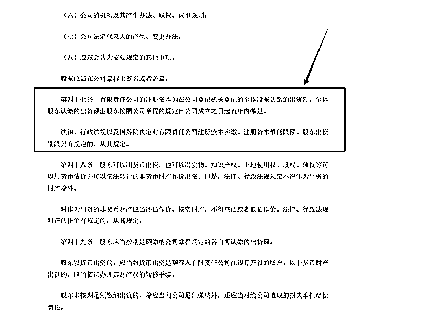
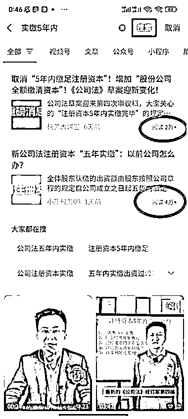

# 新公司法要求有限责任公司五年内缴足注册资本，相关业务有望增长

> 原文：[`www.yuque.com/for_lazy/xkrm14/nt3pc3acs8ckz8e8`](https://www.yuque.com/for_lazy/xkrm14/nt3pc3acs8ckz8e8)

作者： 徐 Ken

日期：2024-01-02

点赞数：**50**

* * *

正文：

新的《中华人民共和国公司法》要求有限责任公司自公司成立五年内缴足注册资本。
2023 年 12 月 29 日第十四届全国人民代表大会常务委员会第七次会议修订《中华人民共和国公司法》，要求有限责任公司自公司成立五年内缴足注册资本。对于已经注册超过 5 年的有限责任公司，会有过渡期逐步调整到 5 年内缴足注册资本（如图一所示）。具体内容可参考全国人大官网第四十七条：。
2024 年 7 月 1 日开始实施这个政策，有不少公司可能会减资或注销，由此带来大量公司变更业务。做相关业务的圈友可以提前布局，从企查查等平台查询相关企业并加上联系方式。另外，顺便搜了一下相关的公众号文章，解析这个政策的文章的阅读量还可以（如图二），做公众号流量主的圈友可以参考爆款文章发布内容。[中华人民共和国公司法 _ 中国人大网](http://www.npc.gov.cn/npc/c2/c30834/202312/t20231229_433999.html) 

* * *

评论区：

陳逸陽 : 已经开始了，代账公司坐地起价要 3000 帮忙做减资

徐 Ken : 下手真快

徐 Ken : 多谢亦仁大大

陶金金（阎老板） : 我的妈

徐 Ken : 阎老板，要不要变更？我帮你对接，让我顺便赚个跑腿费[呲牙]

陶金金（阎老板） : 我想注销哈哈哈

倪大胖 : 以前注册的存量公司等具体的过渡期政策，可以不着急减资

* * *

公众号搜索，懒人专属群分享