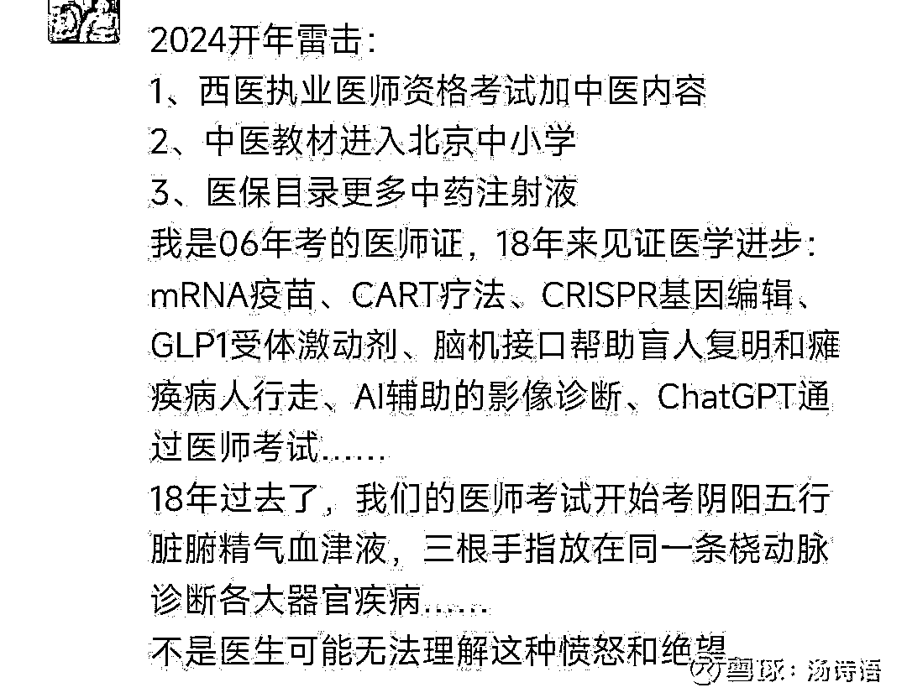
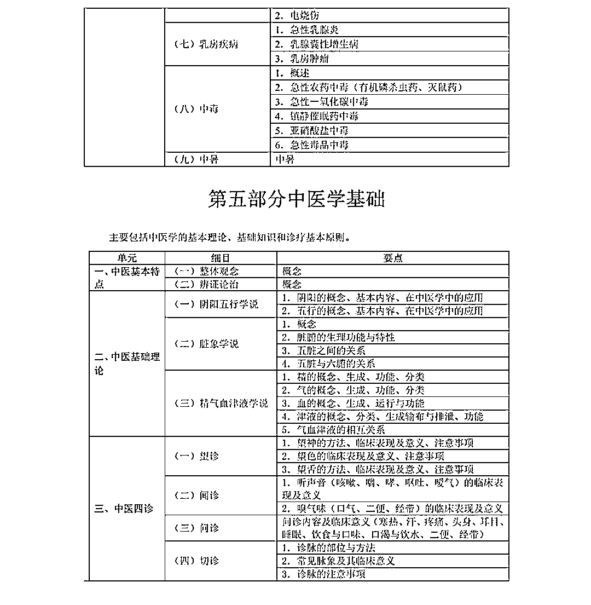
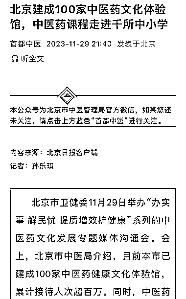

# 西医执业考试加试中医内容，中小学也将引入中医教育

> 原文：[`www.yuque.com/for_lazy/xkrm14/ondtm5h8aq6ii0oa`](https://www.yuque.com/for_lazy/xkrm14/ondtm5h8aq6ii0oa)

作者： 薇姐创富

日期：2024-01-05

点赞数：**50**

* * *

正文：

西医执业资格考试加试中医内容。中医内容进入北京中小学内容 中医赛道加速

* * *

评论区：

晓燕 : 离火运来啦

风与月 : 绝望啥？

阿广 : 西医是科学，中医讲不清楚，两个逻辑是背离的

一只鸵鸟 : 赞同。每一种草药含有的成分太多了，西药就是提炼出某一种有效的成分

* * *

公众号搜索，懒人专属群分享