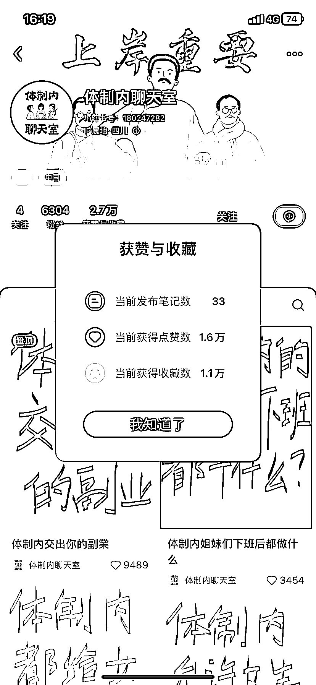
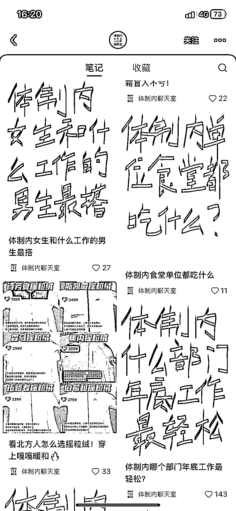
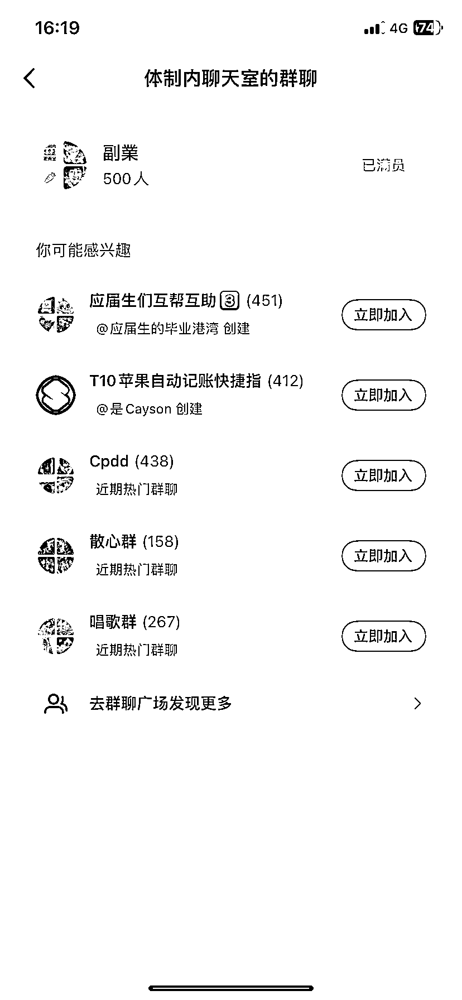

# 小红书手写封面引发热议，涨粉六千，接三个广告，引流副业私域

> 原文：[`www.yuque.com/for_lazy/xkrm14/lcrmnzkh3shg6qol`](https://www.yuque.com/for_lazy/xkrm14/lcrmnzkh3shg6qol)

作者： 非逻辑店长

日期：2024-01-09

点赞数：**58**

* * *

正文：

小红书体制内话题，用手写封面提出讨论主题，不到一个月涨粉六千，接了三个广告。还能引流副业私域。

* * *

评论区：

Kevin : 同在体制内，我是不是也可以参考弄一个[得意]

Martion : 体制外有没有类似的？感觉像是微博平台有那种社畜茶水间

Shawn 小羊 : 这个花爷有讲过

* * *

公众号搜索，懒人专属群分享