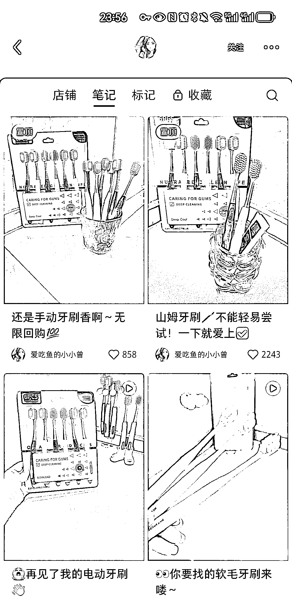
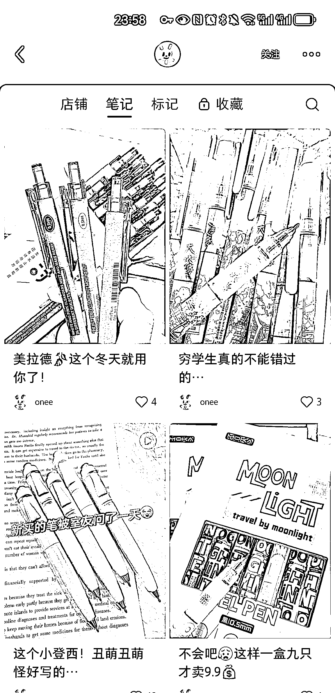
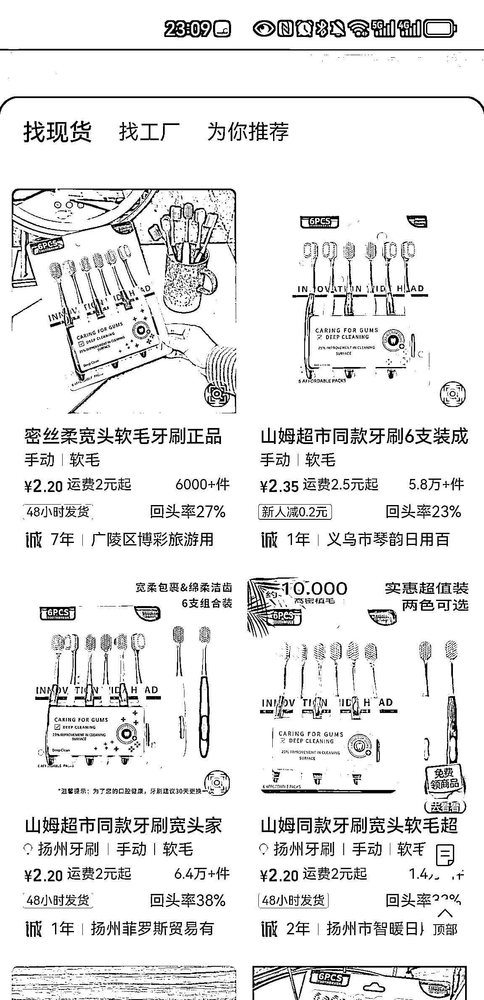
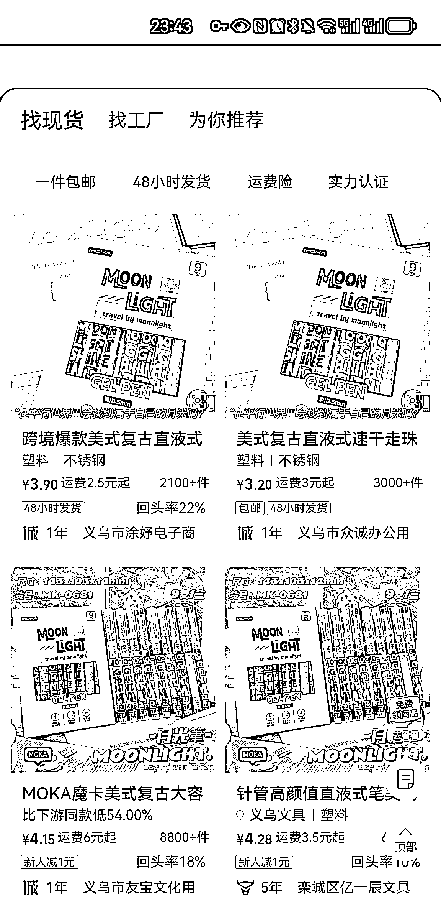

# 小红书低粉爆款链接揭示：牙刷和笔成为热销商品

> 原文：[`www.yuque.com/for_lazy/xkrm14/dc6kiezig5pl4r5i`](https://www.yuque.com/for_lazy/xkrm14/dc6kiezig5pl4r5i)

作者： Primavera2*

日期：2024-01-08

点赞数：**33**

* * *

正文：

在小红书上刷到两个低粉爆款链接。 牙刷上架时间 11 月底，笔上架时间 12 月下（图 1，图 2）且一直主推该单品的图文笔记 牙刷客单价：9.9 元，销量：2.4w+
笔客单价 9.9，销量 1.5w+ 图 3 图 4 1688 拿货价，代发都有足够的利润空间，商品属性可囤货、日常使用消耗品，且有一定比例复购率

* * *

评论区：

* * *

公众号搜索，懒人专属群分享