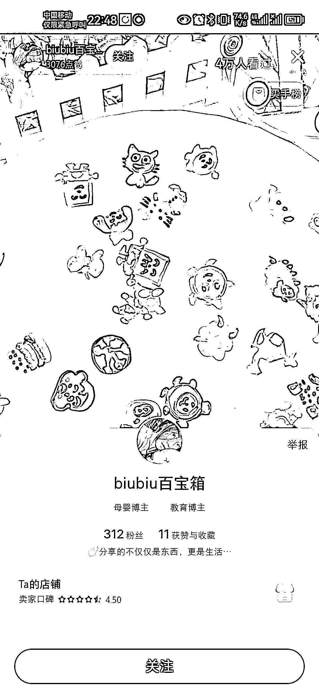
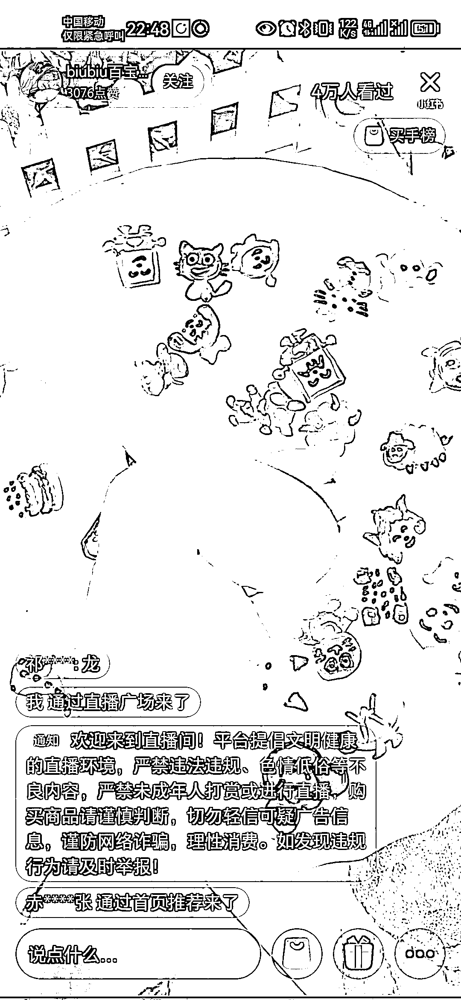
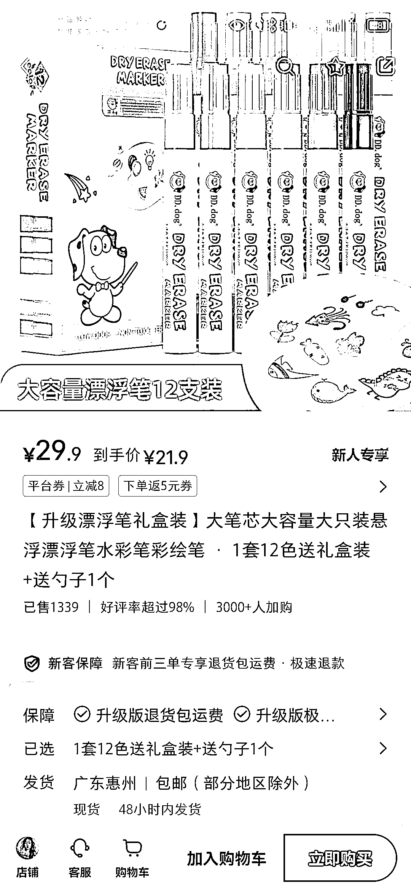
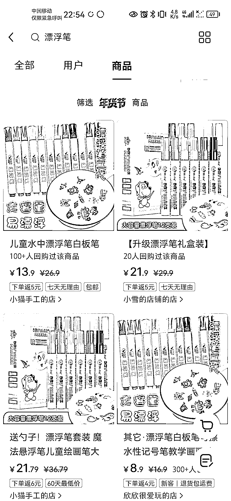
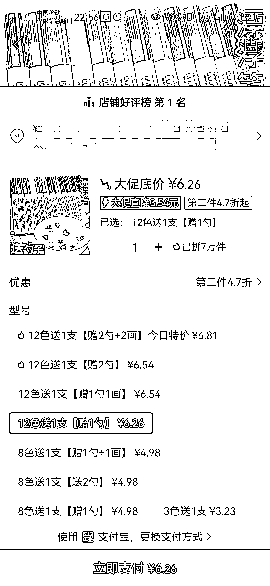

# 小红书上热卖的漂浮笔，销量火爆超预期

> 原文：[`www.yuque.com/for_lazy/xkrm14/ndkd0ob1hz6gcfkr`](https://www.yuque.com/for_lazy/xkrm14/ndkd0ob1hz6gcfkr)

作者： 浮云

日期：2024-01-09

点赞数：**34**

* * *

正文：

小红书上刷到一个新账号不露脸直播卖漂浮笔，边画边演示呈现笔的有趣卖点。在线观看人数 4 万而且还在快速增长，都超过了其他高粉账号。很多人评论指定画内容，直播观看停留时长很好。
小红书上漂浮笔卖家 20 多块钱，销售量 1000 多件；销量第一卖 13.6 块，已经卖出了 8000 多件，复购率超过了 12％。拼多多上这个产品的卖价只有 6.16，一件代发超过 50％+的利润率。

* * *

评论区：

alice : 不瞒您说，我买过[偷笑]

娜娜 : 去年 2023.6 月视频号看过直播，准备抢暑期档开直播卖，可惜不才，[流泪]样品买回家了，画不好。

浮云 : 这个画画确实是难点，得会画 还要画的快

奔腾 : 快手 抖音 母婴、小孩类的，都可以去小红书试试水

* * *

公众号搜索，懒人专属群分享