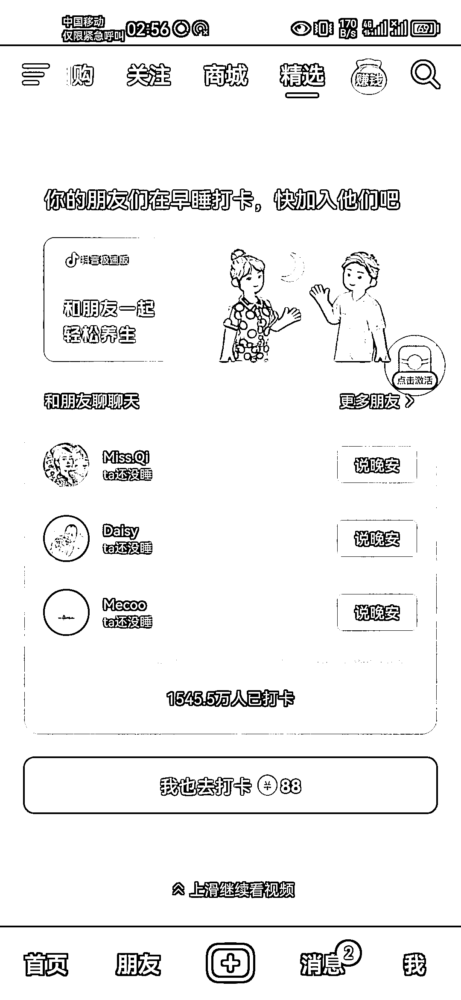
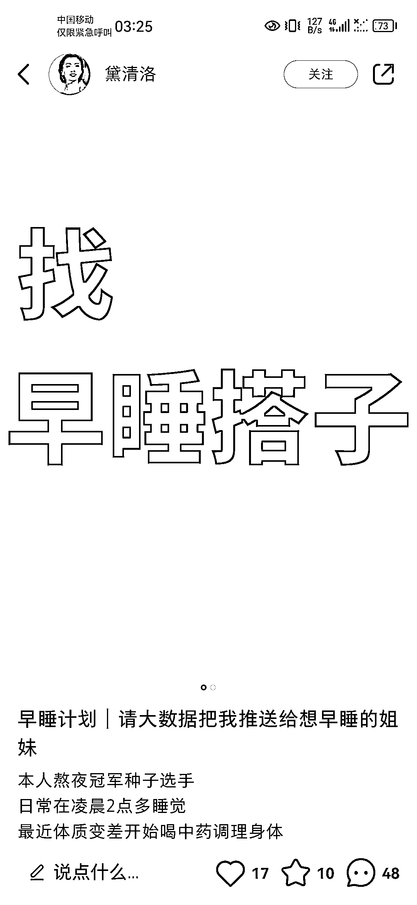
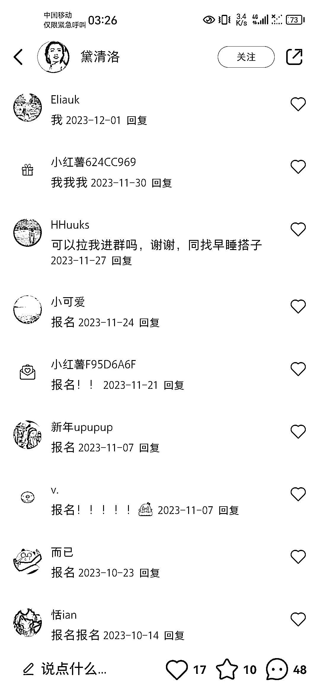
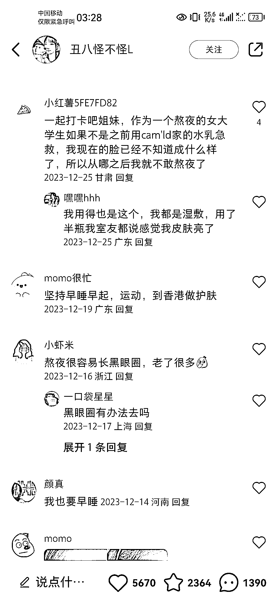
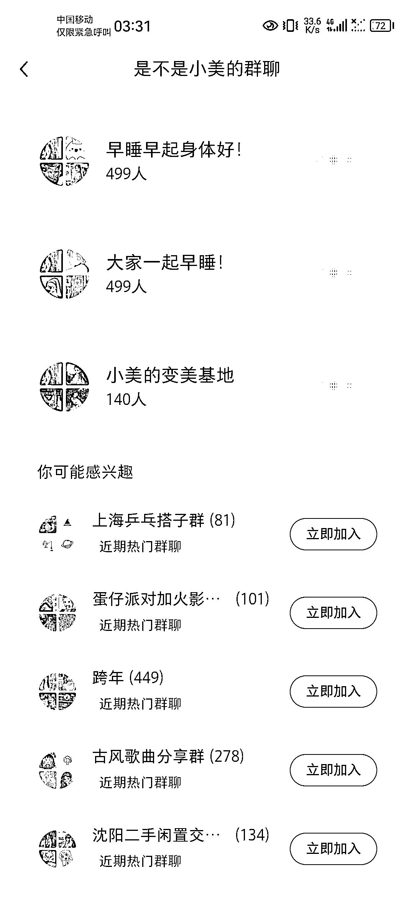

# 抖音官方“早睡打卡“的视频，总共有 1545.5 万人加入了打卡

> 原文：[`www.yuque.com/for_lazy/xkrm14/ramqdgir51a0zxe0`](https://www.yuque.com/for_lazy/xkrm14/ramqdgir51a0zxe0)

作者： 浮云

日期：2024-01-09

点赞数：**51**

* * *

正文：

刷到一个抖音官方“早睡打卡"的视频，发现自己的好些朋友加入了打卡，总共有 1545.5 万人加入了打卡。这个打卡人群非常庞大。
自己随后去小红书搜早睡打卡，发现没粉丝的素人发“早睡搭子”的视频就有好些人评论说要参与；还有小红书博主发早睡打卡皮肤变好的帖子，下面评论基本都说自己也要早睡，几个群也都加满。另外，整个抖音和小红书做早睡打卡的人很少。
可以引流这部分庞大人群到私域变现，比如收费进搭子群互相监督、美容美妆等产品销售……

* * *

评论区：

豆豆 : 搭子经济

* * *

公众号搜索，懒人专属群分享