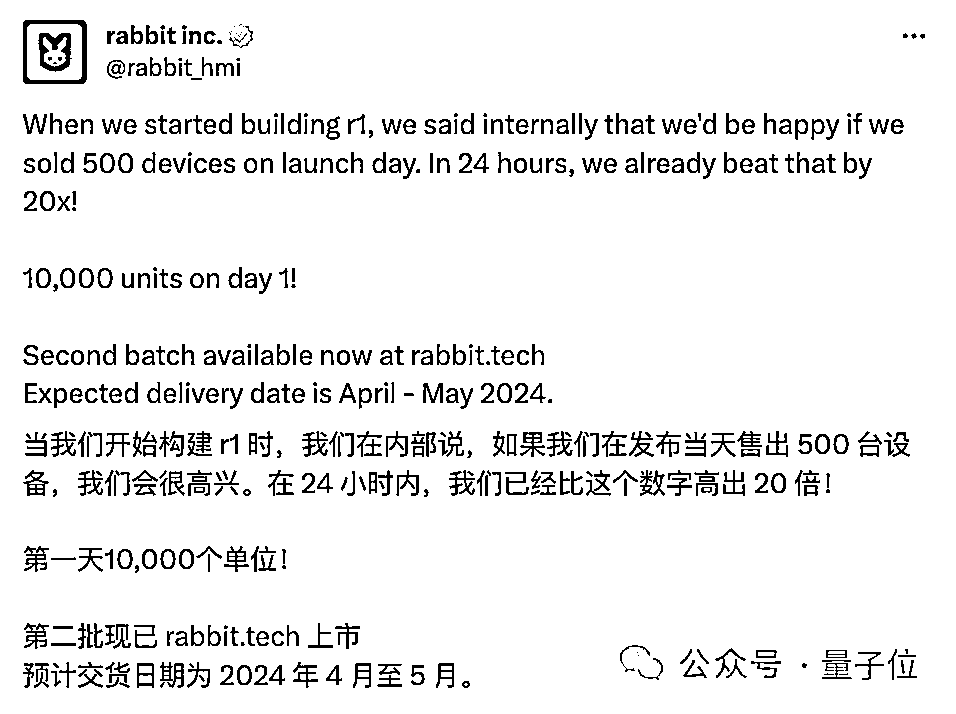
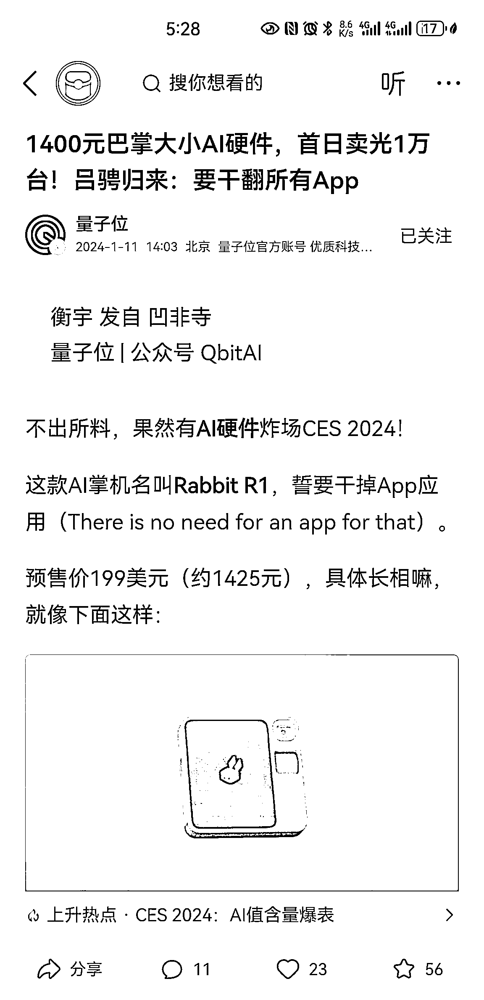

# 1400 元巴掌大小 AI 硬件首日售罄 1 万台，吕骋回归：要征服所有 App

> 原文：[`www.yuque.com/for_lazy/xkrm14/ix0asvl3pv61gz3s`](https://www.yuque.com/for_lazy/xkrm14/ix0asvl3pv61gz3s)

作者： Aimmon

日期：2024-01-11

点赞数：**67**

* * *

正文：

1400 元巴掌大小 AI 硬件，首日卖光 1 万台！吕骋归来：要干翻所有 App
按下侧边按键，500 毫秒就能唤醒对话系统，“问任何想问的问题”，然后得到语音回答，并且是配备字幕的那种
R1 通体亮橙色，其重量约为 115 克，正面有一块 2.88 英寸的触摸显示屏。 屏幕右侧上方，是一颗能够 360° 旋转的 AI 摄像头。
摄像头下面是操作滚轮，侧边对应着圆形按键。滚轮用来选择、导览，而按键则是一键唤醒语音助手的快捷键。
据介绍，R1 还配备了麦克风、扬声器，可以说是麻雀虽小五脏俱全。 [`m.toutiao.com/is/iLYKjLJn/`](https://m.toutiao.com/is/iLYKjLJn/) 

* * *

评论区：

波叔 : 这个牛

发达 : 手机上叠加它的核心功能，不就干掉它了吗[闭嘴]

海阔天空 : 它是要干软件 APP

望天吼 : 这个东西我想到了，但是只是想到了，别人已经做出来了[抱拳][抱拳][抱拳]，后面一两年内国内市场应该也会出现类似的产品

* * *

公众号搜索，懒人专属群分享