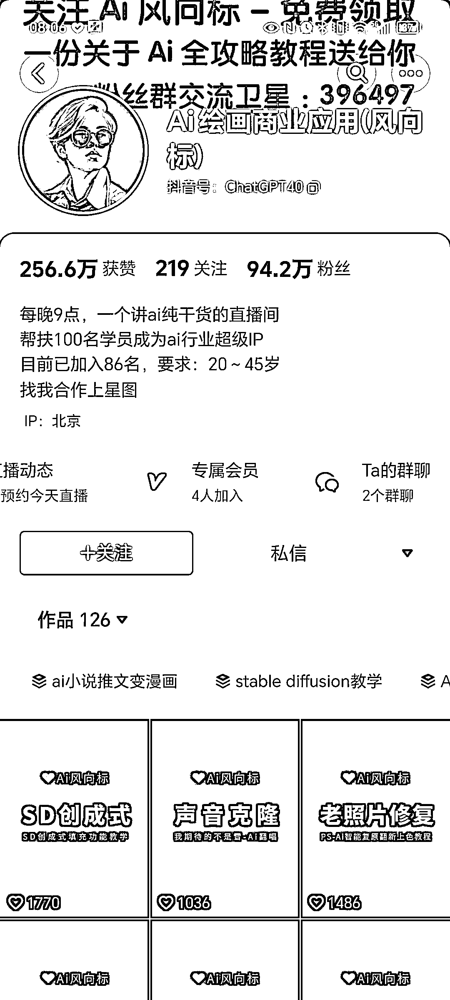

# AI 风向标账号：半年 90W+粉丝，多元收益模式揭秘

> 原文：[`www.yuque.com/for_lazy/xkrm14/xbfmw6928bks0sv2`](https://www.yuque.com/for_lazy/xkrm14/xbfmw6928bks0sv2)

作者： 苏东皮

日期：2024-01-08

点赞数：**34**

* * *

正文：

某音发现一个 AI 风向标账号，半年时间粉丝达到 90W+
截至目前发布 120 多条视频，每条视频点赞上千，每天一场直播。视频内容主要是各类 AI 工具的使用，直播内容估计也是一样。
我是搜索 AI 声音克隆的时候发现的，发现这个账号还提供定制需求，还有其他各类 AI 定制，这是变现的一个来源，
另外看简介还有招学员，而视频也可以接 AI 工具的推广。 估计收益来源主要是定制+教育+推广费

* * *

评论区：

* * *

公众号搜索，懒人专属群分享