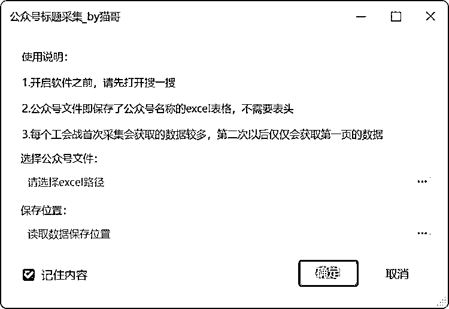

# 免费工具：公众号数据采集小工具，提高创作效率

> 原文：[`www.yuque.com/for_lazy/xkrm14/psqa0dma2dskn8tq`](https://www.yuque.com/for_lazy/xkrm14/psqa0dma2dskn8tq)

作者： 猫哥

日期：2024-01-11

点赞数：**210**

* * *

正文：

做公众号流量主必备的小工具
前几天有个小伙伴说外面有卖读取公众号标题数据的工具，不过价格太贵，于是我就做了一个这样的工具，本着自用的原则，现把工具分享给大家，工具完全免费。 使用场景
我们在创作公众号上的时候，经常需要查看对标账号的数据，方便自己获取爆款的话题。 每天手动的查看数据，然后复制粘贴，不仅效率低，而且浪费时间，影响心情。
那么，这个小工具就是为了解决这个问题而诞生的。 软件功能 通过导入若干个公众号名称，软件会自动模拟真人操作，读取公众号的历史文章标题、阅读数量、发文日期等。
同时为了方便使用，对保存的数据进行了处理，合集则是包含了历史读取的所有内容，单个公众号文件，则仅仅是包含单个账号的数据。 软件教程及获取地址：
[`ex5bha8e8ip.feishu.cn/docx/JHKDdNZCAoQ9Box...`](https://ex5bha8e8ip.feishu.cn/docx/JHKDdNZCAoQ9BoxC5Ryc8ttUn8A) 

* * *

评论区：

霖子 : 你让收费的怎么活[机智][机智]

三行 MU : 厉害了猫哥

高超 : 省钱了一直用付费工具

加英 : 特别感谢猫哥的分享。已三连。

猫哥 : 有帮助就行。有问题可以直接留言

林幻雨 : 猫哥。搜索完第一条以后会报错 显示 运行失败 搜索公众号 第[27] 条指令出错: 未找到元素,元素名

晓聪 : 猫哥，我开了一个表格，第一列第一行写上「桌子的生活观」，其他的什么都没了，然后运行软件，结果什么都没有出现，查看日志之后，如图所示。请问这是什么情况呢？

猫哥 : 这个是不影响正常运行的。

* * *

公众号搜索，懒人专属群分享