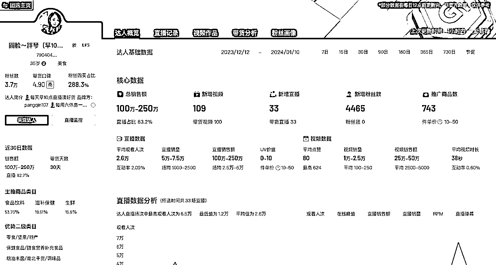
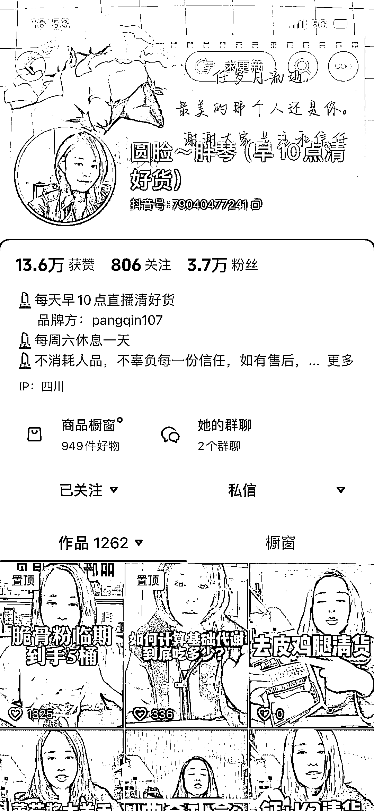
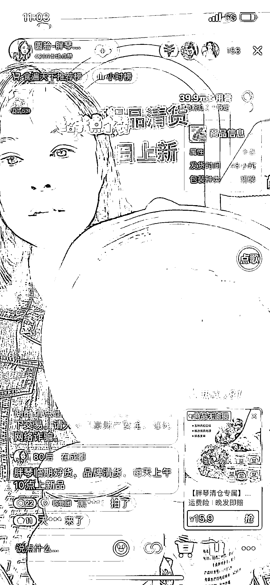
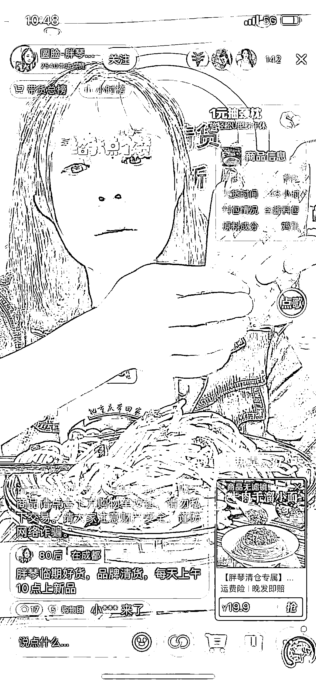

# 清货账号火爆，临期商品销量大增，直播带货成新趋势

> 原文：[`www.yuque.com/for_lazy/xkrm14/ga47f9ozokk6x6aw`](https://www.yuque.com/for_lazy/xkrm14/ga47f9ozokk6x6aw)

作者： 六道

日期：2024-01-11

点赞数：**99**

* * *

正文：

一个 3.7 万粉丝的清货账号，最近 30 天卖了 100-250 万。（图一） 当前经济形势下行，人的消费趋于谨慎保守，拼多多市值超过阿里。
临期食品，临期化妆品，销量开始猛增。 拍摄短视频，挂车直接带货（图三、图四） 直播间，一个人直播，没有助理，直接带货（图五、图六）
场景比较简单，模仿的难度不大，感兴趣的朋友可以试试。

* * *

评论区：

波叔 : 这个牛逼

蒋小兔🍑 : 货源怎么找啊

六道 : 前期精选联盟就可以

* * *

公众号搜索，懒人专属群分享