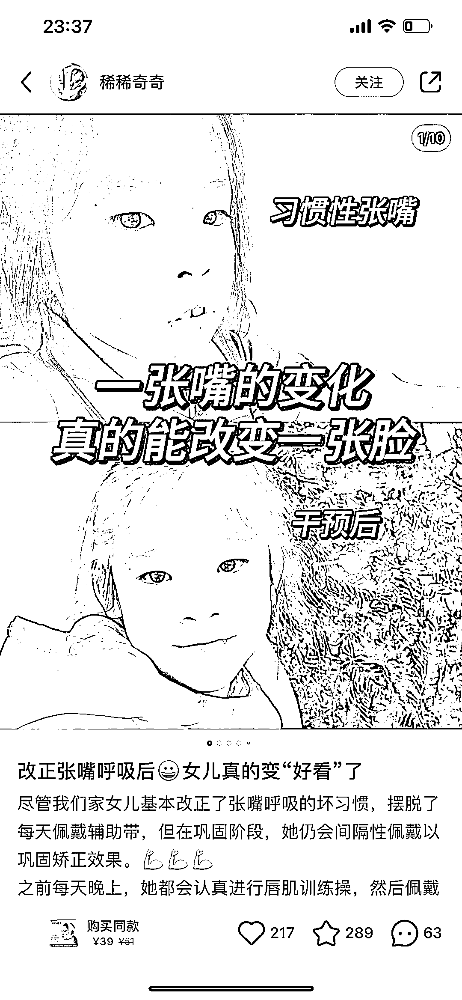
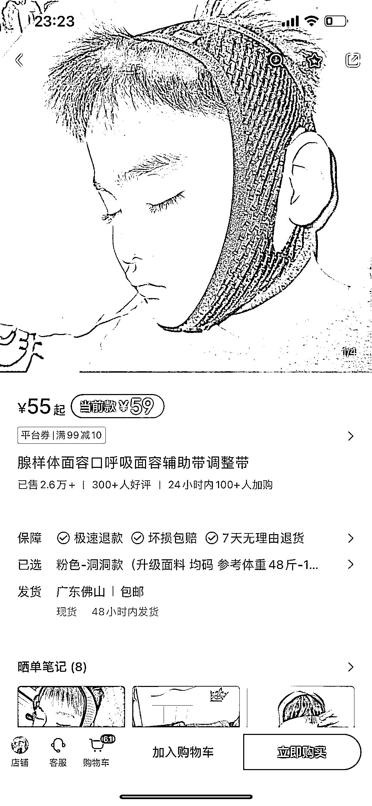
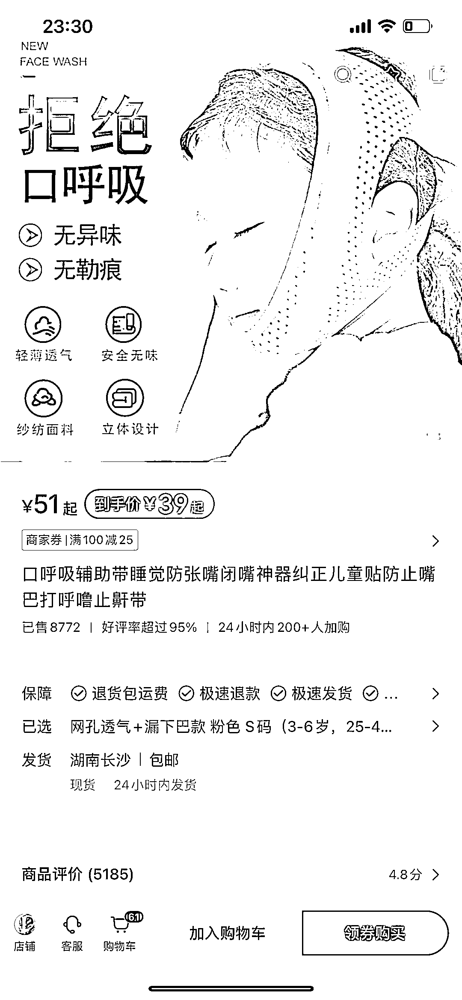
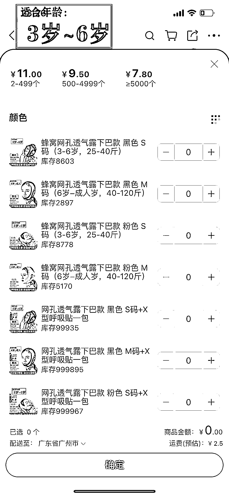
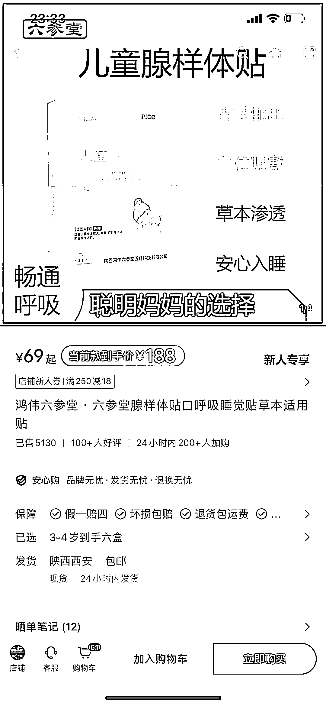

# 口呼吸矫正器：小红书儿童用户市场利润空间高

> 原文：[`www.yuque.com/for_lazy/xkrm14/qsg11mi7pdpyodqg`](https://www.yuque.com/for_lazy/xkrm14/qsg11mi7pdpyodqg)

作者： W.

日期：2024-01-08

点赞数：**37**

* * *

正文：

口呼吸矫正器，用户定位儿童 利润空间高 阿里巴巴批发价 7[11，小红书 39]59， 几十块就能解决一大问题， 甚至上百的客单价都能冲到销量 5100+
能长期做的一个品

* * *

评论区：

猎鲸者 : 刚性需求

字节叔叔 : 买过一个，一是小孩不喜欢戴（被勒着不舒服），二是效果不好，佩戴了也一样会张嘴[捂脸]

* * *

公众号搜索，懒人专属群分享