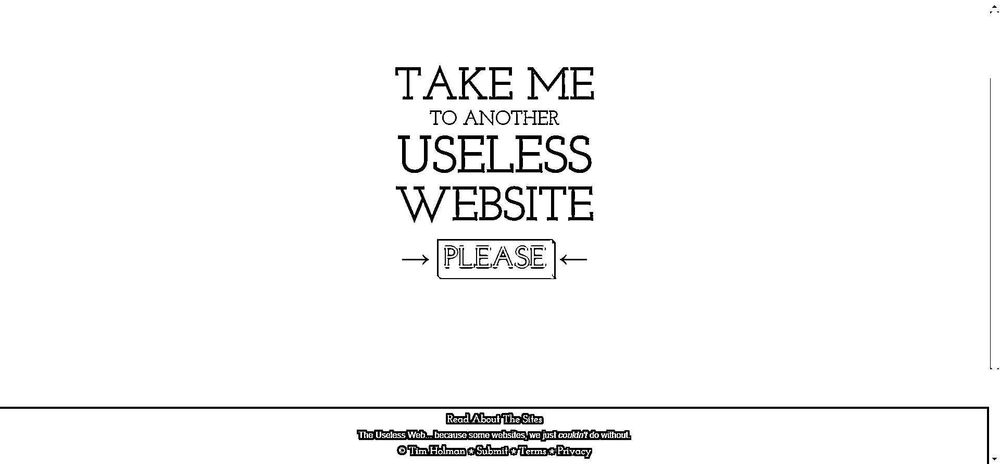
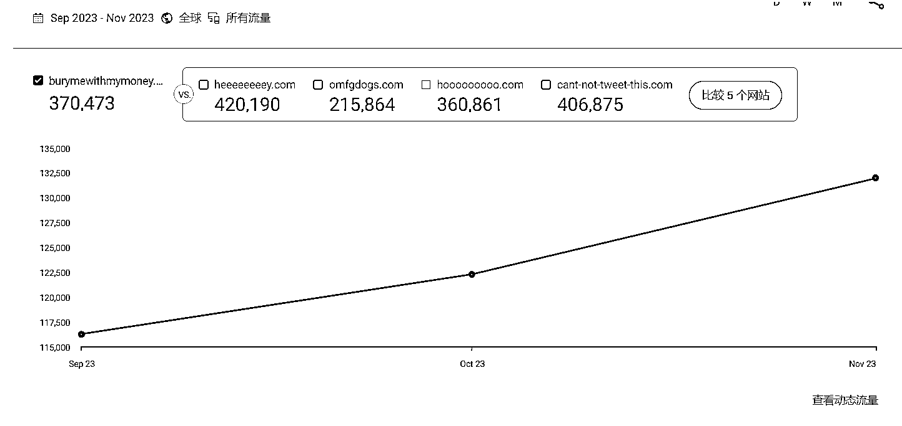
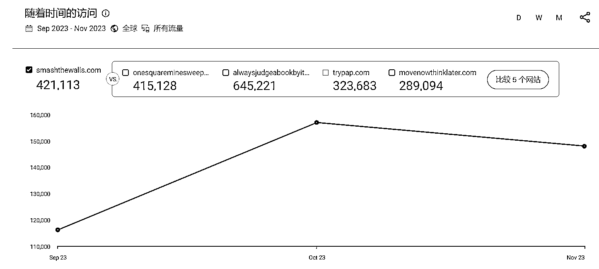
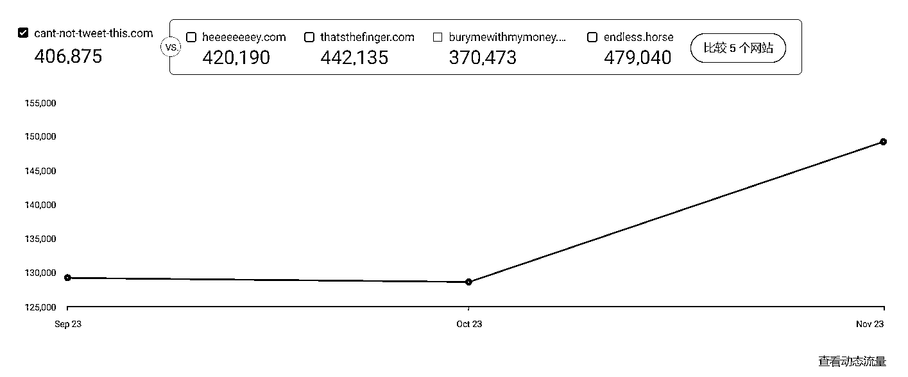

# 一个有趣的网站，每次随机抽卡一个有趣的小游戏

> 原文：[`www.yuque.com/for_lazy/xkrm14/shnzo420clgxham4`](https://www.yuque.com/for_lazy/xkrm14/shnzo420clgxham4)

作者： 晴天哥哥

日期：2024-01-09

点赞数：**34**

* * *

正文：

分享一个很有意思的网站(图一)。 这个网站每次随机抽卡一个 funny website
，大多数抽卡出来的都是一个小游戏站，个个流量都不错(图二、图三、图四)。 收集这个网站的出站链接，做一个导航站(还可以加一个随机抽卡功能)；或者做个类似的
funny website 是不也可行？ 源码可以直接扒或者淘宝拼多多买，然后买个域名用 vercel 部署就可以直接上线了。 [The Useless
Web](https://theuselessweb.com/)

* * *

评论区：

字节叔叔 : 看了下，随机打开的 useless website 跟这个网站是有关的，有些网站右下角有个【A USELESS WEB
PROJECT】链接，点击就跳转回主站（）了。如果要做这类型的网站，不能用这个网站的随机链接，得自己做才行。[呲牙][The Useless Web](https://theuselessweb.com/) 

* * *

公众号搜索，懒人专属群分享