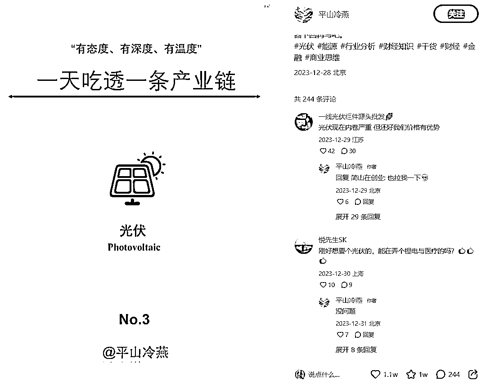
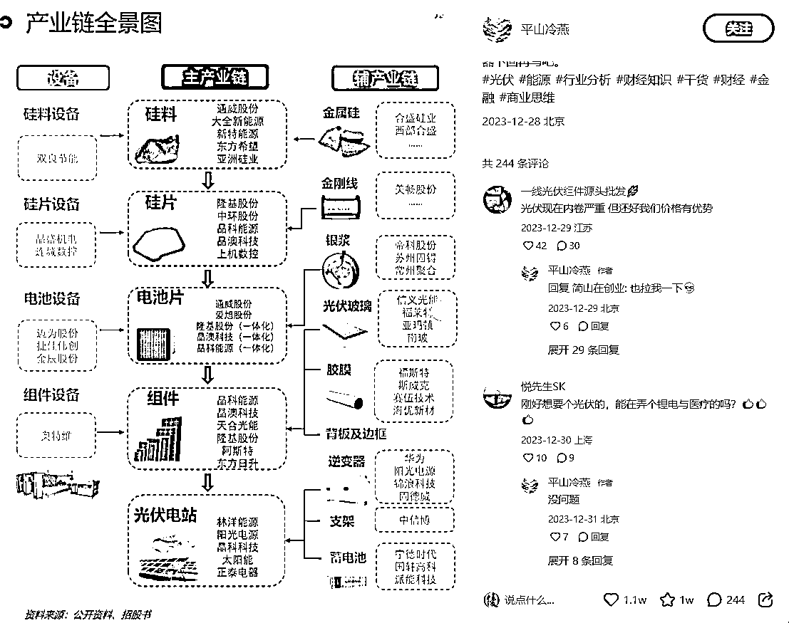

# 专业产业链介绍，引起业内人士关注，数据可观

> 原文：[`www.yuque.com/for_lazy/xkrm14/tkz7aspe0n7aq78r`](https://www.yuque.com/for_lazy/xkrm14/tkz7aspe0n7aq78r)

作者： 启点

日期：2024-01-09

点赞数：**45**

* * *

正文：

一天介绍一条产业链，点赞 1.1w，收藏 1w，数据相当可观。 做出这样的图应该是有详细的专业文件，吸引点赞收藏的大概率是业内人士，内容不能敷衍，专业性很重要。
虽然做这内容可能不太容易，但吸引来的应该非常精准，在评论中也能看到纷纷提出的各类需求，确实专业有需要的才会收藏，可能是卖资料或者专业咨询，那转化率应该也不差的。

* * *

评论区：

红日 : 一天了解一个公司浏览量也不错

启点 : 嗯，都是定好位，这类型的不少

西瓜苗 : 这个在专业的软件比如同花顺 ifind 或者 wind 上面都是整理好的

启点 : 那样获取资料就方便了，也是有了解的才知道

koalabear : 这个吸引的应该都是股民

* * *

公众号搜索，懒人专属群分享