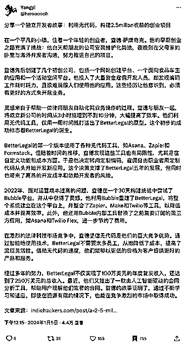
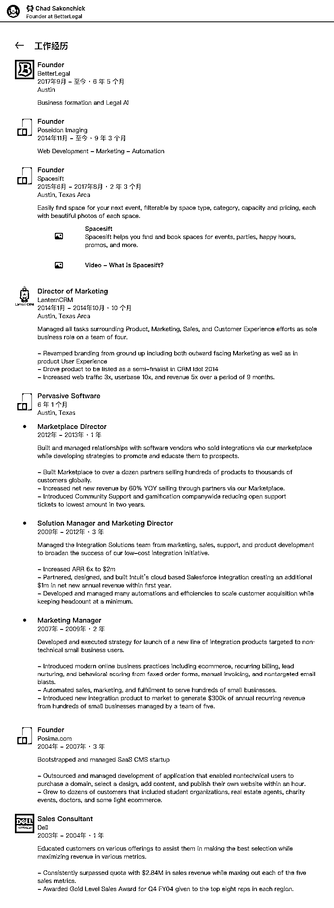

# 无代码创业者年入 250 万美元的生财故事

> 原文：[`www.yuque.com/for_lazy/xkrm14/ypk0e67gelrgviks`](https://www.yuque.com/for_lazy/xkrm14/ypk0e67gelrgviks)

作者： 林林 AIGC 写作

日期：2024-01-08

点赞数：**33**

* * *

正文：

有很多圈友都会很羡慕具备编程能力的独立开发者，因为他们通过为发达国家的客户开发程序、网页就能赚取大量外汇。
说实话作为一名文科生我也很羡慕这类人，但是最近在 X 平台（原 Twitter）网友 Yang Yi 的推荐下，我有幸阅读到了一篇通过无代码（No-
Code）年入 250 万美元的生财故事，因此也让我相信即使不具备编程能力，我们也能以独立开发者的身份来变现。 这篇文章讲述了 Chad
Sakonchick 如何创办了一家年收入达 250 万美元的初创公司，而且完全是通过无代码（No-Code）的方式建立的。 Chad
Sakonchick 的创业之旅始于他 20 多岁时，最初他和父母住在一起，白天帮父亲的朋友安装和维护化粪池系统，晚上则与海外开发者沟通、从事项目开发。在接下来几年，他创立了几家公司，其中包括一家允许用户创建网站的公司、一个为食品卡车老板设计的应用程序以及一个活动空间平台。
起初，Chad 投入了数万美元用于开发，但他发现编码需要大量时间，并且不应该浪费时间去开发他认为人们需要的东西。这促使他寻找更好的方法。
而 Chad 的转机，就来自于帮助一位律师朋友自动化其业务操作。他们将成立新公司的时间从 3 小时缩短到不到 10 分钟，这种效率使得律师能够在每个新公司的成立上收费降低 75%，同时每分钟赚取更多的钱。Chad 在一周内构建了原型，并通过 Google
Ads 投入 900 美元，几小时内就回本了 600 美元。这个初步的成功促成了 BetterLegal 的成立。 值得一提的事，Better
Legal 的第一个版本是使用各种无代码工具（如 Asana、Zapier 和 Formstack）构建的。但随着时间的推移，开发成本增加，一切进展缓慢且经常延迟。2022 年，由于运营成本过高，公司董事会指示将所有开发成本削减到最低限度。这时，Chad 加入了一个 30 天的建站挑战，并首次尝试了 Bubble，这成为了他解决开发问题的答案。
在 90 天内，Chad 使用无代码工具重新构建了 Better
Legal。他使用 Bubble 作为整个系统的基础平台，并开发了一些内部工具来替代他们之前支付订阅费用的第三方应用。这不仅降低了成本，还提高了效率。
对于没有编程基础但想通过独立开发赚钱的普通人来说，Chad 的故事给了我们很大的启发。首先，它证明了即使没有技术背景，也可以通过利用无代码工具成功创业。其次，它展示了如何通过自动化和简化流程来提高效率和降低成本。最后，这个故事鼓励人们寻找创新的解决方案，而不是仅仅依赖传统的编码方法。
当然了，你也可以说 Chad 的成功很大程度归功于一些难以被取代的先天优势，但我相信既然你有兴趣和毅力看完这篇风向标，那么你也会主动思考如何扬长避短，从 Chad 的故事给到的启发中找到能够落地对标实操的可能。
对中国的独立开发者以及没有编程基础的普通人来说，提供了以下几个商业上的重要启发：
1.无代码工具的价值：Chad 利用无代码工具成功构建并优化了他的业务，这表明即使没有深厚的编程知识，人们也能通过这些工具实现复杂的业务需求。对于中国的创业者和小企业主来说，这意味着他们可以更快速、低成本地测试和实现他们的创意。
2.快速原型开发和迭代：Chad 在一周内就构建了 BetterLegal 的原型，显示了快速原型开发的重要性。这对于资源有限的创业者来说尤其重要，因为它允许他们快速测试市场反应，然后根据反馈进行调整。
3.灵活性和成本效益：Chad 通过使用无代码工具来降低运营成本和提高效率，这对于所有希望保持业务灵活性和成本效益的创业者都是一个重要的教训。特别是在竞争激烈的市场中，这种灵活性可以成为一个重要的竞争优势。
4.技术的适应性和学习能力：Chad 的故事强调了适应新技术和不断学习的重要性。对于没有编程背景的人来说，学习如何使用这些新兴的无代码工具可以打开新的机会之门。
5.市场定位和创新：Chad 通过在法律科技领域的创新，找到了他的市场定位。这表明，通过专注于特定领域并提供创新解决方案，即使是小型企业也能在市场上脱颖而出。
6.利用人工智能和自动化：BetterLegal 最终引入了人工智能工具来提高服务质量。这表明，即使是小型企业也可以通过利用 AI 和自动化工具来提升产品和服务，增强竞争力。
感谢网友 Yang Yi 的推荐，让我们有机会了解到这篇鼓舞人心的故事。

* * *

评论区：

* * *

公众号搜索，懒人专属群分享