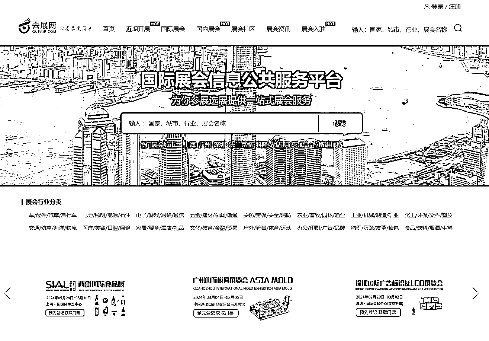
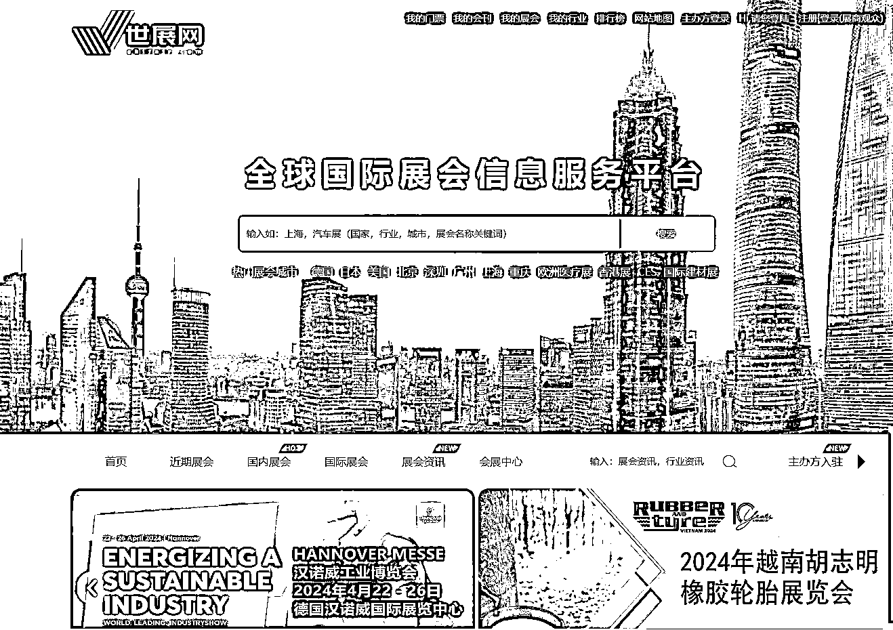
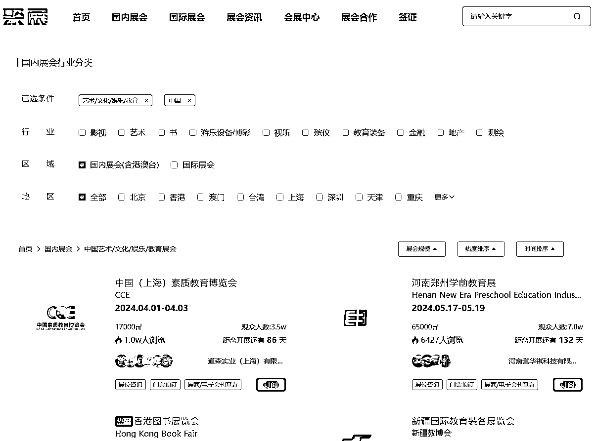
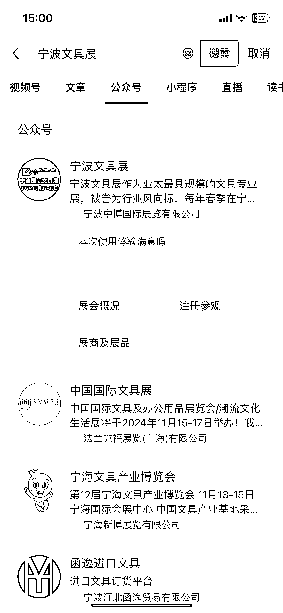

# 参加行业展会，快速了解产品和供应链，获取资料和人脉

> 原文：[`www.yuque.com/for_lazy/xkrm14/pq7euyxce5bh2woh`](https://www.yuque.com/for_lazy/xkrm14/pq7euyxce5bh2woh)

作者： 冷静

日期：2024-01-08

点赞数：**32**

* * *

正文：

如果想要快速了解一个行业的产品、供应链，可以去参加一下行业的展会，会有很多厂家或贸易公司参加，还有下游的一些采购商。看需要到现场链接，可以快速收集到相应的资料、人脉。
看展会的专业性及规模可以参考一下这几个数据：举办历史、展会面积、展商数量、观众数量。
找对标展会的流程：选择行业、再选择自己周边的城市看看有没有相对应的展会。如果没有的话选择广州、深圳、上海这几个城市，举办的展会规模会比较大。
前期推荐这几个网站：去展网、世展网、聚展网，国内外的展会都可以找到。
找到对标展会之后不要直接在这些网站上预订门票，可能会有门票费用，可以用微信搜索展会的公众号或小程序，在展会官方预订一般是免费的。提前注册好观展证，到时候方便入场。

* * *

评论区：

* * *

公众号搜索，懒人专属群分享