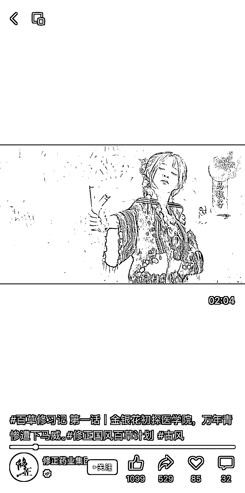

# 品牌短剧定制：国内短剧红利流失，赛道仍有机会

> 原文：[`www.yuque.com/for_lazy/xkrm14/dsaq5npiooz6p7of`](https://www.yuque.com/for_lazy/xkrm14/dsaq5npiooz6p7of)

作者： 廖坤 momo

日期：2024-01-08

点赞数：**27**

* * *

正文：

大家好，我是廖坤，一个做了 3 年广告，6 年娱乐营销的生财新人，目前在经营一家营销公司。
关于短剧，随着广电下场，国内市场会逐渐趋于正规，各种依靠暴力、擦边、不正确价值观内容爆火的的项目会骤减。
个人观察，品牌短剧目前尚有红利存在。不管是美妆、快消都在大量投入短视频植入、带货，部分敏感行业，如医药保健等（非黑五）其实有大量品牌传播需求，如修正药业拍摄的《百草修习记》，将中草药拟人化，短剧内核是传播中草药文化，修正品牌信息也通过场景、台词进行植入。
品牌短剧可以代替品牌日常的短视频、TVC，不仅内容更加丰富、年轻化，同时也更便于传播，相比于品牌动辄大几十、上百万的广告拍摄也更加具有长尾效应。
总结下来，国内短剧红利正在极速流失，有短剧编剧、制作资源的家人们可以尝试下品牌短剧定制的赛道。 欢迎大家随时沟通！

* * *

评论区：

廖坤 momo : 谢谢亦仁

三生 : 这不就运气来了

* * *

公众号搜索，懒人专属群分享