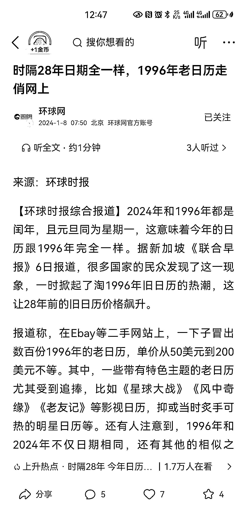

# 2024 年日历与 1996 年完全一样，引发淘 1996 年旧日历热潮

> 原文：[`www.yuque.com/for_lazy/xkrm14/ll5ogbphy1wyov93`](https://www.yuque.com/for_lazy/xkrm14/ll5ogbphy1wyov93)

作者： Aimmon

日期：2024-01-08

点赞数：**26**

* * *

正文：

【环球时报综合报道】2024 年和 1996 年都是闰年，且元旦同为星期一，这意味着今年的日历跟 1996 年完全一样。据新加坡《联合早报》6 日报道，很多国家的民众发现了这一现象，一时掀起了淘 1996 年旧日历的热潮，这让 28 年前的旧日历价格飙升。
报道称，在 Ebay 等二手网站上，一下子冒出数百份 1996 年的老日历，单价从 50 美元到 200 美元不等。其中，一些带有特色主题的老日历尤其受到追捧，比如《星球大战》《风中奇缘》《老友记》等影视日历，抑或当时炙手可热的明星日历等。还有人注意到，1996 年和 2024 年不仅日期相同，还有其他的相似之处，比如这两年都有奥运会。
[`m.toutiao.com/is/iLRhRYuS/`](https://m.toutiao.com/is/iLRhRYuS/)

* * *

评论区：

晨冬 : 看了一下，农历不同

Aimmon : 你再质疑环球网？ 国外有一些国家没有使用农历的概念的，只有，中国，越南，韩国，新加坡，蒙古，日本等习惯农历

晨冬 : 各表达观点，没有什么是不能质疑的

七楼顶 : 是咯，表达分享而已嘛，有什么好较真的

* * *

公众号搜索，懒人专属群分享