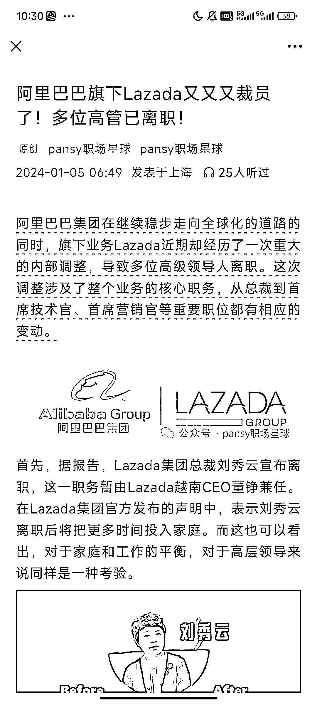
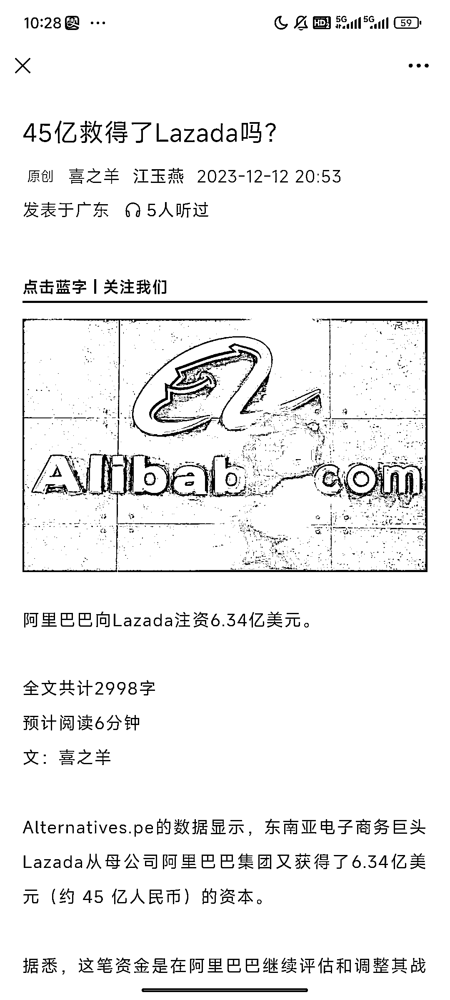
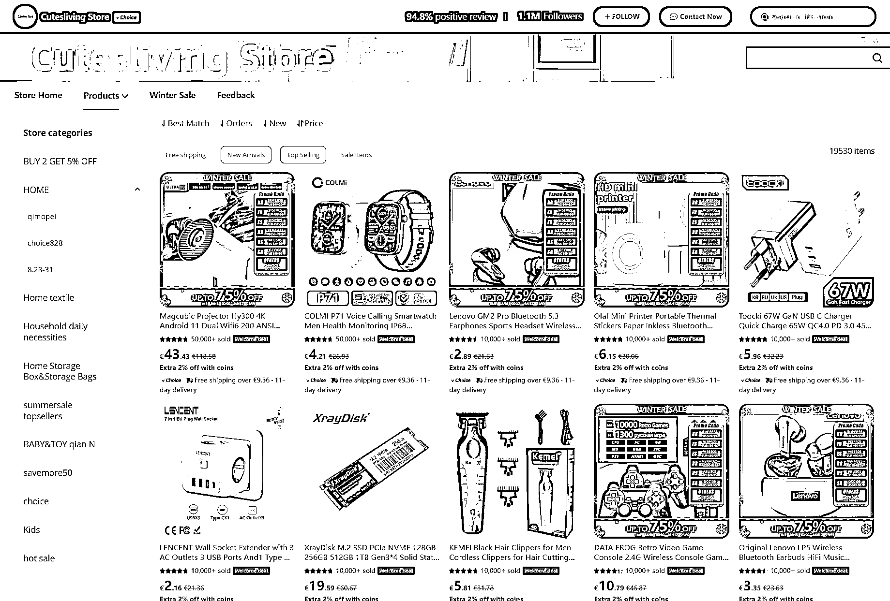
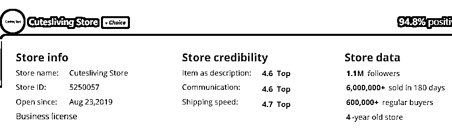
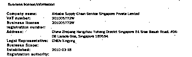

# Lazada 裁员高管离职，风向标指向历史变革与机遇

> 原文：[`www.yuque.com/for_lazy/xkrm14/irbxz1y1abvc2icd`](https://www.yuque.com/for_lazy/xkrm14/irbxz1y1abvc2icd)

作者： 李方元

日期：2024-01-10

点赞数：**31**

* * *

正文：

lazada20 多天前，Ali 注入了 6 个多亿美元，折合人名币 40 亿，然后前几天有开始裁员，很多高管离职。平台早早就有自营店。正是历史变革的时机。这个平台出现了危机，但危机伴随着机遇。有准备入场跨境的朋友可以观察研究新出的政策，选品方面也要避开和自营店同质化的产品，特别是外观，性能指标近似的。

* * *

评论区：

* * *

公众号搜索，懒人专属群分享