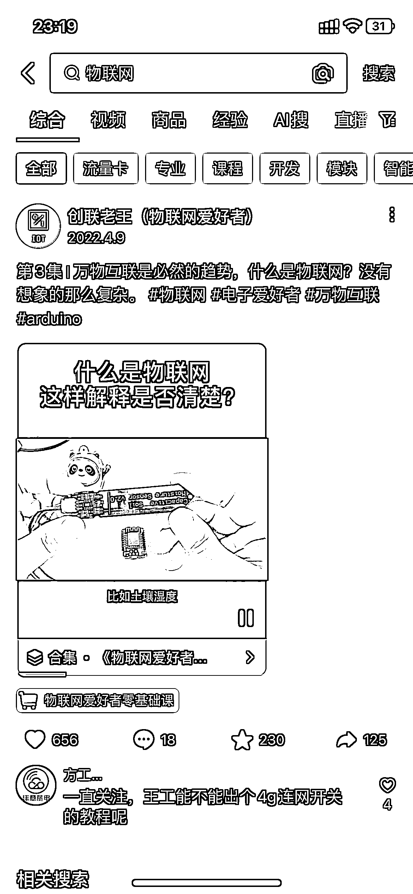
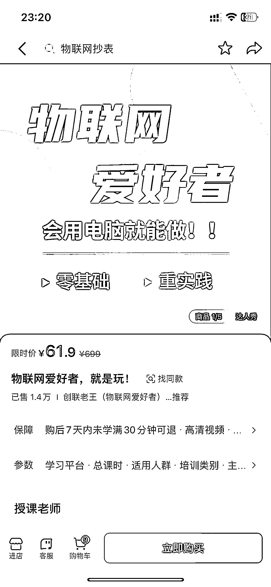
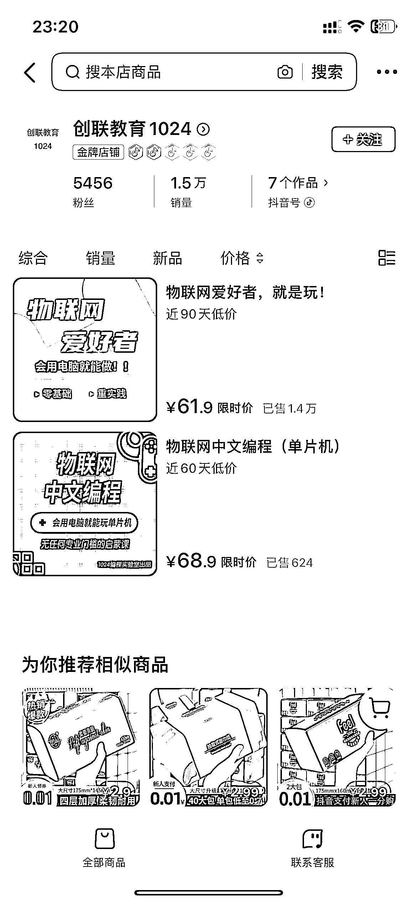

# 物联网知识付费：教小白玩物联网，收入可观

> 原文：[`www.yuque.com/for_lazy/xkrm14/go2smu7ispw7d6n0`](https://www.yuque.com/for_lazy/xkrm14/go2smu7ispw7d6n0)

作者： Times'up

日期：2024-01-08

点赞数：**25**

* * *

正文：

物联网知识付费，主要靠卖课程，教小白玩物联网。对于有好奇心的人还是挺有吸引力的。目前客单价 61.9，总共卖了 1.4 万件，收入相当可观；拓展玩法可以顺带卖开发板，课程使用的模块，万用表等相关工具。

* * *

评论区：

* * *

公众号搜索，懒人专属群分享