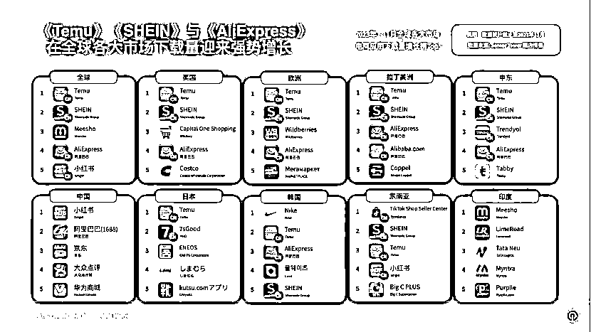

# 2023 年出海电商 App 风向标：Temu、SHEIN、AliExpress 等成热门选择

> 原文：[`www.yuque.com/for_lazy/xkrm14/xw0dofuixflx0qul`](https://www.yuque.com/for_lazy/xkrm14/xw0dofuixflx0qul)

作者： 兰心

日期：2024-01-12

点赞数：**59**

* * *

正文：

Temu、SHEIN 和 AliExpress 无疑是 2023 年风头最盛的出海电商 App。这 3 款 App
在多个市场的下载榜和下载增长榜上都占据身位，也有一些 App 在部分市场表现不俗，例如 Trendyol 在中东，TikTok Shop Seller
Center 在东南亚。而最眼生的出海平台是 7sGood，在日本市场拿下下载量增长榜第二位。想拓展电商平台的商家可以关注。

* * *

评论区：

兰心 : 感谢亦仁大大

* * *

公众号搜索，懒人专属群分享