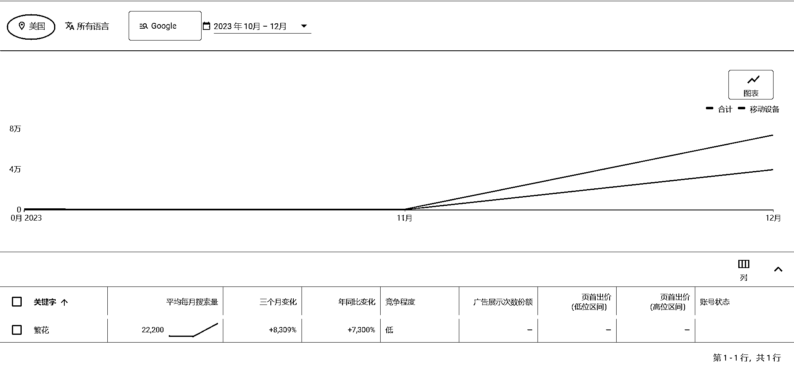
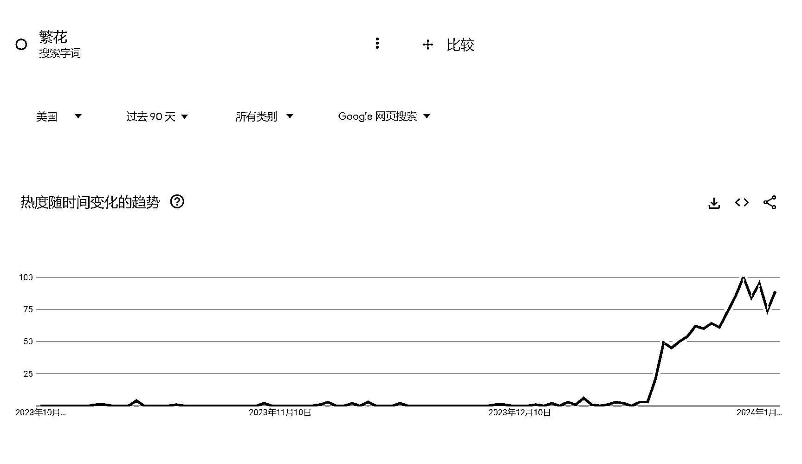
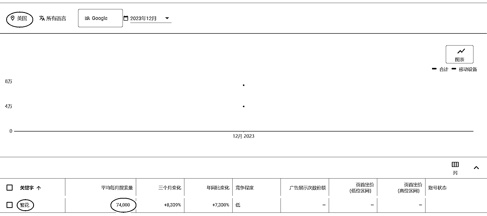
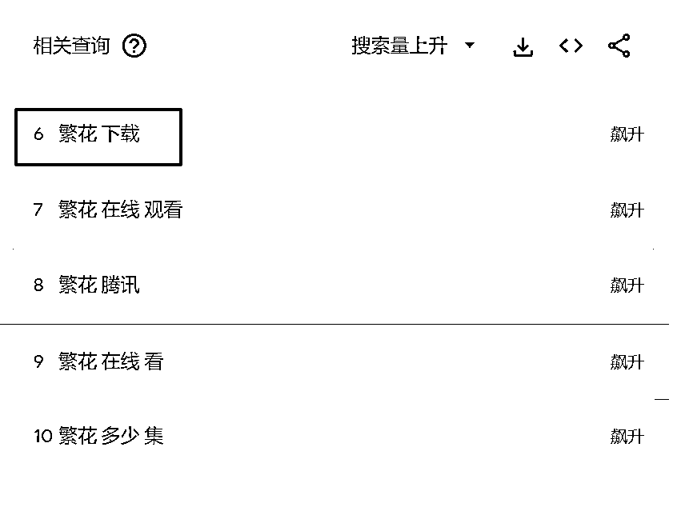

# 国外热搜《繁花》成为引流新粉的利器

> 原文：[`www.yuque.com/for_lazy/xkrm14/lmeezvxrb9q3hh7c`](https://www.yuque.com/for_lazy/xkrm14/lmeezvxrb9q3hh7c)

作者： 浮云

日期：2024-01-11

点赞数：**53**

* * *

正文：

今天在抖音搜了下《繁花》，看到有个在帖子评论区说: “繁花在国外也火了，这几天国外朋友话题都是繁花，还有人开车去唐人街找排骨年糕”
打开关键词规划师和谷歌 tends 看了下，趋势确实很好，美国搜索量 12 月份 7.4 万，看了下欧洲国家也还不错。有做华人生意或者留学生生意的圈友可以用繁花人物和视频做素材引流新粉了，或者做跨境的朋友可以卖相关产品了。
搜索的时候发现了个飙升搜索词“繁花下载”，围绕这个可以做海外工具、用资料做海外网盘/APP 拉新了……

* * *

评论区：

波叔 : 电视剧带火一座城

离心之巅 : 请问一下这个搜索工具是什么呢

浮云 : google keyword planner 和 google trends

离心之巅 : 谢谢！

* * *

公众号搜索，懒人专属群分享